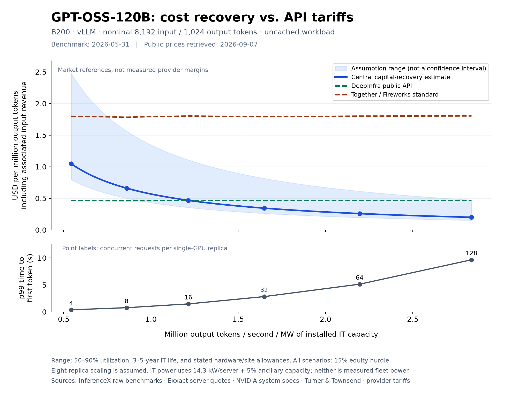

# First public-data comparison: GPT-OSS-120B

Working research result, retrieved 2026-09-07. This is evidence and interpretation
for us, not proposed blog prose. Global model defaults and the draft post are
unchanged. The comparison script uses explicit local scenarios.



## What the first comparison tells us

The model can plausibly reproduce the scale of public API tariffs without fitting
its inputs to those prices. It does **not** yet identify any provider's margins.
The cheapest observed tariff is close enough to modeled capital recovery that
utilization, hardware lifetime, serving efficiency, and latency matter materially.

At concurrency 16 per replica, modeled initial workload revenue is **$0.47 per
million output tokens**, with a deliberately broad **$0.36–1.11 scenario range**.
The same input/output mix earns approximately **$0.47 at DeepInfra** and **$1.80 at
Together or Fireworks Standard**. The benchmark's p99 first-token latency is
1.47 seconds and mean streaming speed is 151 output tokens/s/user.

Higher concurrency improves cost recovery, but worsens first-token latency. At
concurrency 32, the central estimate drops to $0.35 with p99 first-token latency
2.83 seconds. At 128 it reaches $0.20, but p99 first-token latency reaches 9.66
seconds. Comparing only the cheapest benchmark point would conceal this tradeoff.
These are synthetic-workload timings, not provider latency measurements or SLAs.

## 1. Benchmark observations and selection

The [InferenceX public API](https://inferencex.semianalysis.com/api/v1/benchmarks?model=gpt-oss-120b)
returned six B200/TP1/vLLM points for nominal 8192-input/1024-output sequences on
2026-05-31. All six are included, from the
[same workflow run](https://github.com/SemiAnalysisAI/InferenceX/actions/runs/26696226421/attempts/1).
This is one consistent sweep, not an interpolated envelope of different runs.
The retrieved model endpoint contained 429 observations across hardware/configurations;
we make no claim this selected sweep is the fastest available implementation.

The [pinned recipe](https://github.com/SemiAnalysisAI/InferenceX/blob/1786ed468864e5feef6a7218f3d3d57be6147688/benchmarks/single_node/gptoss_fp4_b200.sh)
uses vLLM v0.22.0, FP4 model execution, FP8 KV cache, no prefix caching or speculative
decoding. The Hugging Face weight revision is not pinned. The
[harness](https://github.com/SemiAnalysisAI/InferenceX/blob/1786ed468864e5feef6a7218f3d3d57be6147688/utils/bench_serving/benchmark_serving.py)
counts output over the full timed serving interval, including prefill.
Lengths vary over 80–100% of their nominal settings; the price conversion uses
**observed input throughput / observed output throughput** at each point.

| Concurrent requests / replica | Output tok/s/GPU | Mean streaming tok/s/user | p99 first token (s) |
| ---: | ---: | ---: | ---: |
| 4 | 1,019 | 270 | 0.38 |
| 8 | 1,615 | 213 | 0.77 |
| 16 | 2,278 | 151 | 1.47 |
| 32 | 3,094 | 102 | 2.83 |
| 64 | 4,121 | 68 | 5.13 |
| 128 | 5,323 | 44 | 9.66 |

Streaming speed above is InferenceX’s reciprocal of mean time per output token,
not the arithmetic mean of individual request speeds.

See [saved raw rows](data/gpt_oss_120b_b200_benchmarks.json) for full precision,
row IDs, measured GPU power, and provenance. The graph uses installed IT capacity,
not GPU telemetry. Eight independent single-GPU replicas are assumed to reproduce
the per-GPU result; shared CPU/memory/network contention is not measured. A 25%
replication loss would raise every modeled price by one-third at otherwise fixed
assumptions. It is separate from the fleet's active/idle utilization assumption.

## 2. Hardware and facility inputs

The [Exxact B200 configuration](https://configurator.exxactcorp.com/configure/TS4-142487900)
lists $391,737.50 for an eight-GPU system with CPUs, 1.5 TB RAM, storage, NVSwitch,
and a three-year warranty. We add its $1,815 network-card option and a 10% central
allowance for other IT costs. Public configured offers motivate the $390k–430k
server span; this is not evidence of hyperscaler procurement prices. Tax, shipping,
installation, external switches/storage, and spare equipment need project-specific
quotes; the allowance does not certify that every exclusion is covered.

The [NVIDIA DGX B200 specification](https://docs.nvidia.com/dgx/dgxb200-user-guide/introduction-to-dgxb200.html)
gives 14.3 kW maximum system power. We use this comparable server as a capacity
proxy, plus 5% ancillary IT power: **15.015 kW per eight-GPU installation**.
This is a different OEM from the purchase quote and is not the benchmark's measured
system draw. Under the current toy model, active electricity consumption equals
this installed capacity, which may overstate actual active power.

[Turner & Townsend](https://reports.turnerandtownsend.com/data-centre-construction-cost-index-2025/data-centre-cost-trends)
reports Atlanta construction at $9.9 million/MW IT. Its
[scope](https://reports.turnerandtownsend.com/data-centre-construction-cost-index-2025/methodology)
excludes land, site/utility works and several other owner costs. We use $12m/MW
centrally, including an explicit, unverified $2.1m allowance. The $10m low case
leaves almost no allowance; the $16m high case gives more headroom. They are
conditional scenarios, not quotes for equivalent completed projects.

| Input | Lower cost | Central | Higher cost |
| --- | ---: | ---: | ---: |
| Eight-GPU server, before added NIC | $390,000 | $391,738 | $430,000 |
| Additional IT-cost allowance | 10% | 10% | 20% |
| Facility CAPEX / MW IT | $10m | $12m | $16m |
| Combined CAPEX / MW IT | $38.70m | $40.83m | $50.51m |
| Active fleet utilization | 90% | 70% | 50% |
| Operating life | 5 years | 5 years | 3 years |

Shared assumptions: 15% pre-tax equity hurdle, 65% debt at 8.5% nominal interest,
two-year equal-spending construction period, 50% residual facility value, PUE1.2,
20% idle draw, $90/MWh electricity with no separate capacity charge, $1m/MW-year
non-energy OPEX, dedicated inference, and zero price/throughput trends. These
remain assumptions, not provider-specific observations. The residual is 50% of
**facility** CAPEX, not 50% of the whole installation. All calculations retain
the model's existing timing and capital recovery rules.

The shaded region combines these scenario endpoints; it is **not a confidence
interval** and does not cover every uncertainty. Neither prices nor benchmark
throughput were used to tune the CAPEX, utilization, or lifetime assumptions.

## 3. Direct provider price evidence

USD per million tokens, retrieved 2026-09-07. No batch discounts or cache hits.

| Provider | Input | Output | Status |
| --- | ---: | ---: | --- |
| [DeepInfra](https://deepinfra.com/openai/gpt-oss-120b) | $0.037 | $0.17 | Public tariff; precision badge and description differ |
| [Together](https://docs.together.ai/docs/serverless/models) | $0.15 | $0.60 | Serverless; explicitly MXFP4 |
| [Fireworks](https://docs.fireworks.ai/serverless/pricing) | $0.15 | $0.60 | Standard; deployment precision not established |

The graph uses P_output + (input/output ratio)*P_input at every benchmark point.
The tiny variation in market-reference lines reflects sampled sequence lengths,
not changing provider prices. Together and Fireworks have identical uncached
rates here. Their actual fleet, batching, cache use, precision details, reliability,
and service quality need not match the benchmark. Together's MXFP4 designation
is the closest documented precision match; it is not an equivalence guarantee.

Additional official Groq and Cerebras tariffs are saved in the evidence JSON,
but omitted from the plot because they use different hardware. This reinforces
that the reference lines are alternative offerings, not observed GPU-provider margins.

## 4. Reproduction and next evidence to seek

Run from the repository root:

```sh
uv run --no-project --with numpy --with numpy-financial --with matplotlib python docs/blog/ai_datacenter_project_finance/plot_open_weights_comparison.py
```

The script reads the checked-in [evidence](data/open_weights_evidence.json) and
benchmark rows without internet access. It writes a PNG and editable SVG under
`docs/assets/images/ai_datacenter_project_finance/`, a
[comparison CSV](data/open_weights_comparison.csv), and an
[expanded assumptions snapshot](data/open_weights_comparison_assumptions.json).
It verifies zero equity NPV for every scenario/benchmark pair and the ordering
of the cost band. Regenerating does not change model defaults or blog prose.

Next, obtain measured whole-server concurrent-replica throughput and power,
then repeat for a materially different workload/model. Real traffic, public-provider
latency measurements, net acquisition prices, and economic lifetime evidence would
help narrow the range. The current result supports a plausibility comparison,
not a conclusive claim of subsidy or profitability for any provider.
