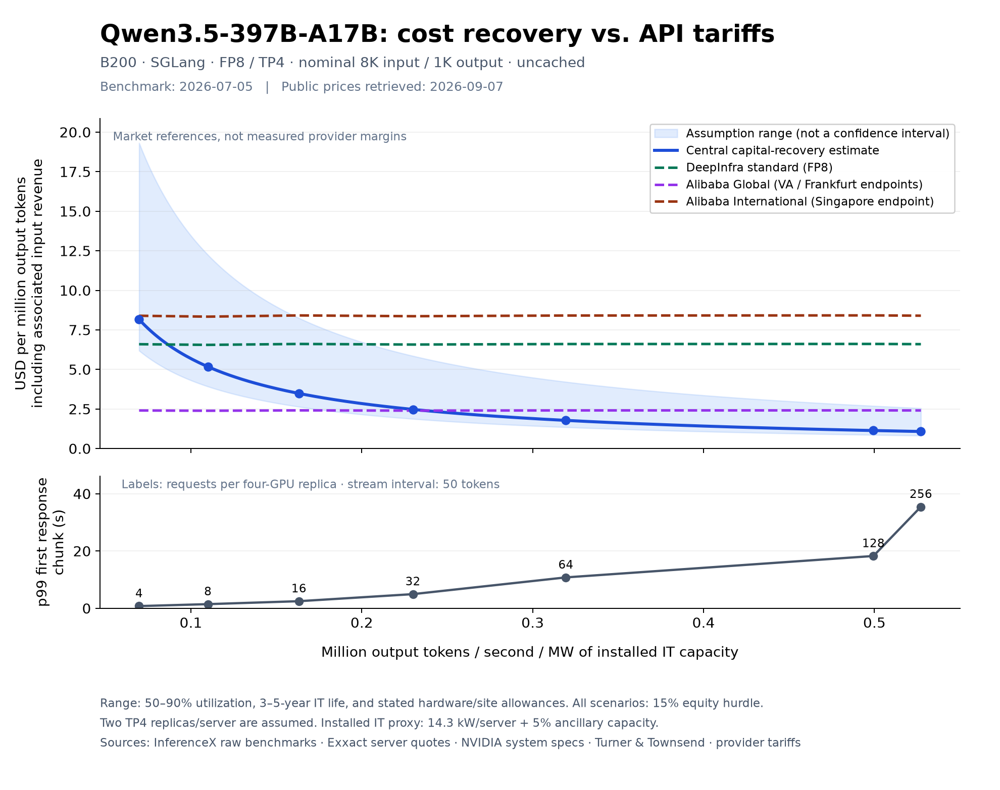

# Second public-data case: Alibaba Qwen3.5-397B-A17B

Working research comparison, retrieved 2026-09-07. This extends the
[GPT-OSS-120B case](open_weights_comparison.md), using the same project economics
and hardware-cost assumptions. It does not modify the human-written blog draft.



## Why this model

Alibaba [released Qwen3.5-397B-A17B on February 16, 2026](https://home.alibabagroup.com/en-US/document-1960233590314762240),
making it a more recent release from a different lab. The
[official model card](https://huggingface.co/Qwen/Qwen3.5-397B-A17B)
describes 397 billion total parameters with 17 billion active per forward pass.
The model supports multimodal inputs; this comparison covers **text only**.

We compare the explicitly named open-weight model, not substitute tariffs for
`qwen3.5-plus`. DeepInfra labels its exact-model public service FP8, providing a
closer precision match than the first case's ambiguous DeepInfra configuration.
It still does not prove identical checkpoint revision, kernels, or quality.

## Benchmark evidence and the normalization

The [InferenceX API](https://inferencex.semianalysis.com/api/v1/benchmarks?model=Qwen-3.5-397B-A17B)
returned 965 records across configurations. We selected the entire seven-point
B200/SGLang/FP8/TP4 sweep without speculative decoding, from one
[July 5 workflow](https://github.com/SemiAnalysisAI/InferenceX/actions/runs/28719983892/attempts/1).
We chose this consistent FP8 sweep for the provider precision match, not to
maximize cost recovery or use the latest available benchmark. Newer FP4 and
MTP-assisted measurements exist; this is not an estimate of the best achievable
serving performance.

The pinned recipe is
[`qwen3.5_fp8_b200.sh`](https://github.com/SemiAnalysisAI/InferenceX/blob/e13168e5162caddfdc14ee3b6ce013e6d995c611/benchmarks/single_node/fixed_seq_len/qwen3.5_fp8_b200.sh).
It uses the official `Qwen/Qwen3.5-397B-A17B-FP8` artifact with SGLang
`v0.5.14-cu130`, FP8 e4m3 KV cache, BF16 Mamba state, and disabled radix caching.
The checkpoint's content revision is not pinned. The synthetic sequence-length
workload and full-interval output throughput convention are the same as in the
first case: nominal 8192 input/1024 output, sampled lengths, with actual
input/output throughput ratios used to calculate tariff revenue. It is not a
semantic benchmark or a real-user traffic trace.

**Latency caveat:** this recipe sets `--stream-interval 50`. The saved `p99_ttft`
is client-observed time to the first response chunk under that setting. It must
not be read as pure first-decoded-token latency or directly compared with the
GPT case's streaming behavior. We have not verified whether SGLang flushes the
first token immediately; the interval does not prove a 50-token wait before the
first response. The lower plot is labeled accordingly. Chunking
does not justify dropping prefill or elapsed time from aggregate throughput.

| Concurrency / four-GPU replica | Output tok/s/GPU | p99 first response chunk (s) |
| ---: | ---: | ---: |
| 4 | 131 | 0.78 |
| 8 | 206 | 1.45 |
| 16 | 306 | 2.48 |
| 32 | 432 | 4.95 |
| 64 | 600 | 10.79 |
| 128 | 937 | 18.27 |
| 256 | 989 | 35.46 |

Here TP4 means four GPUs jointly serve **one** model replica. InferenceX already
normalizes its throughput by those four GPUs. Multiplying per-GPU throughput by
eight assumes **two independent TP4 replicas** fill an eight-GPU server. It does
not mean eight model replicas. Prefill and decode use the same GPUs; their GPU
counts must not be added. Whole-node replication efficiency remains unmeasured.

Installed capacity remains the comparable DGX B200 maximum of 14.3 kW plus 5%
ancillary IT allowance, or 15.015 kW/server. Thus:

    output tok/s/MW IT = output tok/s/GPU * 8 / 0.015015

This uses installed capacity, not measured GPU watts. The installed system is a
proxy rather than an exact identification of the benchmark OEM.

## Independent cost inputs held fixed

The three scenarios retain the first case's
[Exxact purchase quote](https://configurator.exxactcorp.com/configure/TS4-142487900),
[NVIDIA installed-power proxy](https://docs.nvidia.com/dgx/dgxb200-user-guide/introduction-to-dgxb200.html),
and [facility construction anchor](https://reports.turnerandtownsend.com/data-centre-construction-cost-index-2025/data-centre-cost-trends).
They imply $38.70m / $40.83m / $50.51m total CAPEX per MW IT for lower/central/higher
cost scenarios, with 90% / 70% / 50% utilization and 5 / 5 / 3 operating years.
The shade is a deterministic scenario range, not a confidence interval.

Other assumptions remain: dedicated inference; 15% pre-tax equity hurdle; 65%
debt at 8.5%; two years of construction; facility terminal proceeds at 50% of
its original cost; PUE1.2; 20% idle draw; $90/MWh electricity; no separate capacity
charge; $1m/MW-year non-energy OPEX; and no price erosion or throughput growth.
See the first case for acquisition/site-cost exclusions and assumed allowances.
These inputs have not been tuned to the new tariffs.

## Tariff observations

Direct official pages, retrieved 2026-09-07; USD per million tokens. No cache
hits, batch discounts, or promotional rates are used.

| Offering | Input | Output | Revenue at nominal 8:1 |
| --- | ---: | ---: | ---: |
| [DeepInfra standard](https://deepinfra.com/Qwen/Qwen3.5-397B-A17B), FP8 | $0.45 | $3.00 | $6.60 |
| [Alibaba Global](https://docs.modelstudio.console.alibabacloud.com/en/model-studio/qwen3-5-397b-a17b), Virginia/Frankfurt endpoints | $0.172 | $1.032 | $2.408 |
| [Alibaba International](https://docs.modelstudio.console.alibabacloud.com/en/model-studio/qwen3-5-397b-a17b), Singapore endpoint | $0.60 | $3.60 | $8.40 |

Alibaba's exact ID is `qwen3.5-397b-a17b`; the applicable Global price tier is
input <=128K. Its document identifies these as original prices excluding
limited-time promotions. Precision is unspecified. **Global** describes deployment
scope; endpoint location does not establish the physical inference location.
These geographic offerings are not interchangeable procurement terms.

The graph uses each point's measured input/output ratio rather than rounding to
8. Tiny variations in reference lines are workload sampling, not dynamic tariffs.
Output revenue includes generated reasoning as applicable, not only visible answer
text. DeepInfra's priority/flex rates and Alibaba's longer-context rates are excluded.
Together's exact-model listing was found only in stale search results, not its
fresh catalog; it is not treated as a current offer.

## Result and limits

At concurrency **16** per four-GPU replica, required initial revenue is **$3.48**
per million output tokens including associated input revenue. The range is
**$2.64–$8.25**. Corresponding tariff revenues are **$6.61 DeepInfra**, **$2.41
Alibaba Global**, and **$8.41 Alibaba International**. The benchmark's p99 first
response chunk arrives in 2.48 seconds under its chunking configuration.

The central case is below DeepInfra's tariff at concurrency eight and above,
but remains above Alibaba Global through concurrency32 (nearly equal there).
At concurrency64 it drops to $1.78, with p99 first-chunk latency 10.79 seconds.
The final step, 128 to256, buys only about a 5% reduction in modeled price while
nearly doubling this latency metric. Latency requirements therefore materially
constrain the cheapest point one can select.

This is a second plausibility comparison, **not evidence that Alibaba Global is
subsidized**. Provider hardware, precision, optimization, utilization, discounts,
financing, and service targets remain unknown. For this model, public tariffs vary
by more than 3x even within Alibaba's scopes; one global market-price reference
would hide that variation. Comparing the two model cases is also not a controlled
measure of algorithmic progress: model capability, tokenizer, precision, serving
stack, and workload behavior differ.

## Reproduction

```sh
uv run --no-project --with numpy --with numpy-financial --with matplotlib python docs/blog/ai_datacenter_project_finance/plot_open_weights_comparison.py --case qwen35
```

Inputs: [raw benchmark subset](data/qwen35_b200_benchmarks.json) and
[price/input evidence](data/qwen35_evidence.json). Outputs:
[CSV](data/qwen35_comparison.csv), [expanded assumptions](data/qwen35_comparison_assumptions.json),
PNG and editable SVG under `docs/assets/images/ai_datacenter_project_finance/`.
The existing no-argument command still generates GPT-OSS; its numerical CSV is
unchanged. Both cases check target-rate equity NPV and cost-band ordering.
