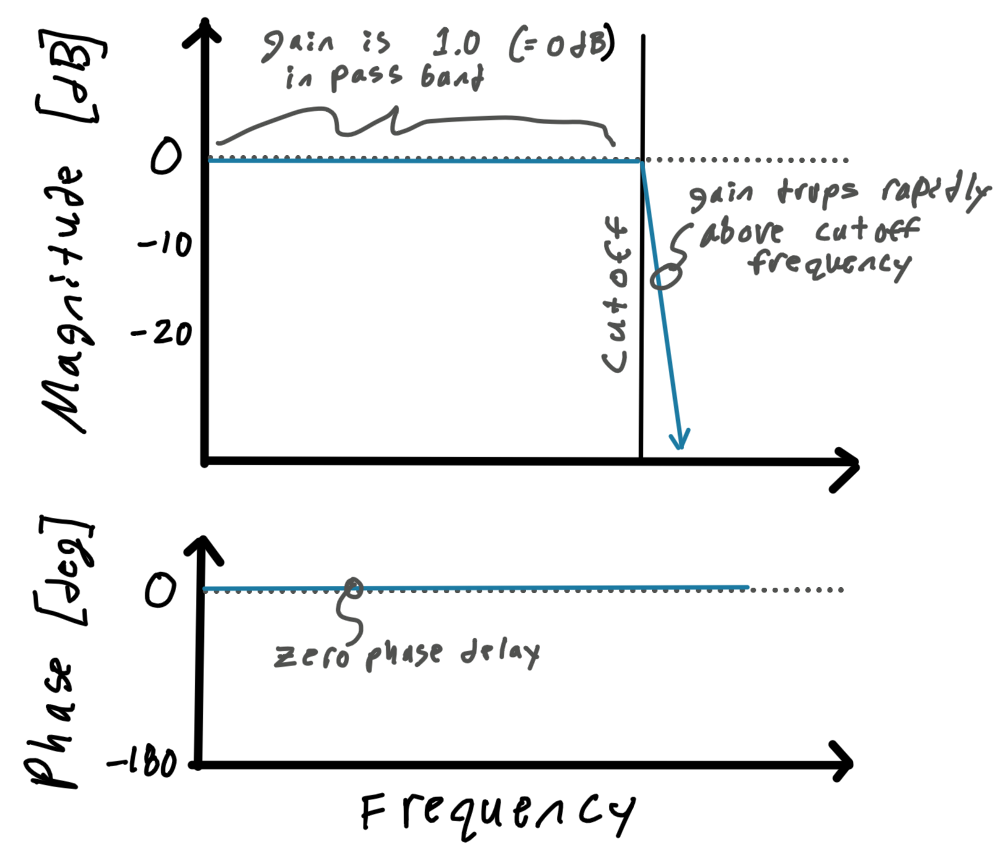
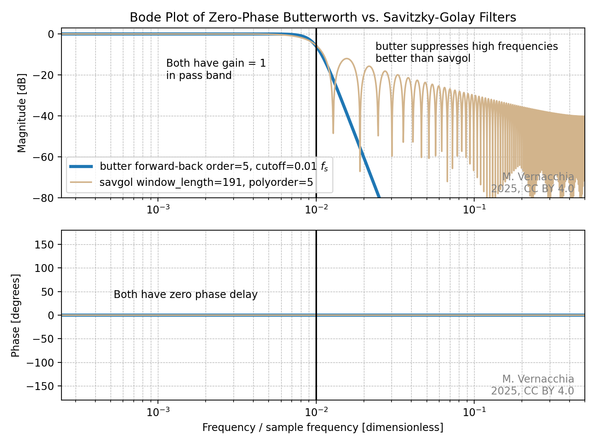
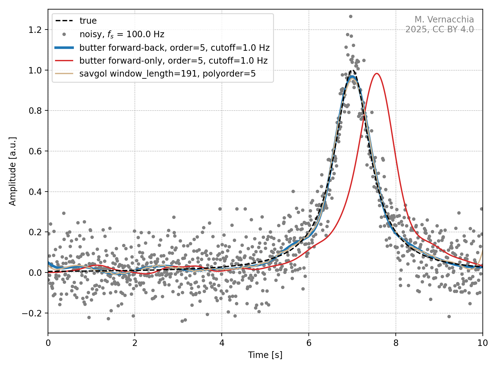
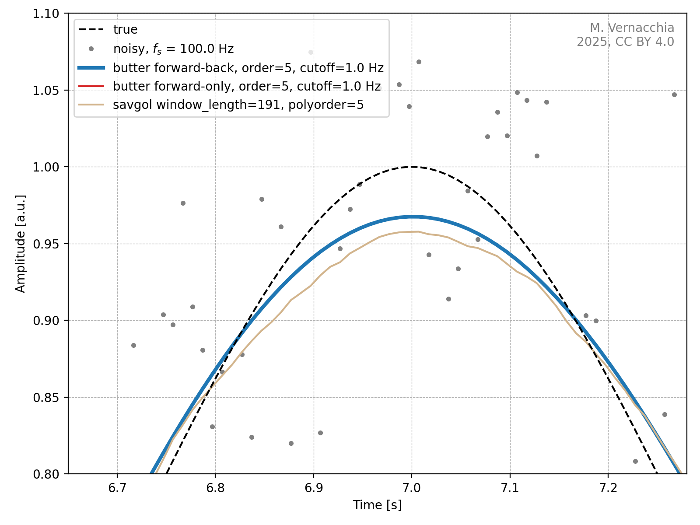

# Prefer Butterworth filter over Savitzky-Golay for scientific post-processing

*2025-05-08*

For science & engineering data analysis, we often need to smooth noisy time-series measurements.
We want to distort the "real" signal as little as possible (in both amplitude and delay), and we are filtering during post-processing (not real time).

The Savitzky-Golay filter is often touted for providing zero amplitude distortion and zero delay.
However, a Butterworth filter applied forward and backward:

- also provides zero amplitude distortion and zero delay
- better removes high-frequency noise
- stands on firmer theoretical ground from a signal-processing perspective

**tl;dr: Stop using the Savitzky-Golay filter for post-processing and use a forward-backward Butterworth filter instead. My recommended solution is:**

```python
from scipy.signal import sosfiltfilt, butter
fs = ...  # [Hz] TODO sampling frequency
fc = ...  # [Hz] TODO filter cutoff frequency
x_raw = ... # TODO your signal
ORDER = 4  # 4 probably is fine, note that applying the filter forward-backward
# effectively doubles the filter order.

sos = butter(ORDER, Wn=fc, fs=fs, output="sos")
x_filtered = sosfiltfilt(sos, x_raw)
```

## The task: remove high-frequency noise without distortion

Often, we are trying to measure a relatively slow phenomenon, but our sensors also pick up high-frequency noise.
For scientific post-processing, it is imperative to remove the high-frequency noise while:

- Accurately preserving the **amplitude of the signal**.
- Accurately preserving the **signal's position in time**, e.g. because we want to determine the times at which some events in the signal occurred.

In signal processing terms, this means we require a filter with:

- Gain of 1 in the pass band
- Zero phase delay

??? "Zero delay with non-causal filters"

    Zero phase delay is not possible with real-time (causal) filters;
    but because we are post-processing, we can cheat and "look ahead in time" (i.e. use a non-causal filter).
    This makes our zero delay requirement possible.

## Meet the contenders

The [Butterworth filter](https://en.wikipedia.org/wiki/Butterworth_filter) has the flattest possible gain in the pass band (for a filter of a given order with monotonically decreasing gain).
That is a strong theoretical recommendation for our scientific post-processing application. 
The parameters of the filter are a cutoff frequency and an order:

- The cutoff frequency should be about 2x the highest frequency you care about in the data, and less than the frequency of known noise sources (e.g. 60 Hz power).
- Higher orders make the filter better until numerical instabilities appear. An order of 4 or 5 is good for post-processing with 64-bit floating-point numbers ([you may need a lower order for numerical stability with 32-bit floats](https://www.dspguide.com/ch20/4.htm)).

The [Savitzky–Golay filter](https://en.wikipedia.org/wiki/Savitzky%E2%80%93Golay_filter) can be thought of as fitting a polynomial to successive windows of the data, but in practice it is implemented as a convolution of the signal with a pre-computed kernel (i.e. a FIR filter).
Theoretically, the Savitzky–Golay filter does not have much to recommend it.
Further, the parameters of the filter are specified as a window length and a polynomial order; it is [tricky](https://doi.org/10.1109/DSP-SPE.2011.5739186) to relate these to the more useful cutoff frequency.


## Visualize filter performance with Bode plots

A [Bode plot](https://en.wikipedia.org/wiki/Bode_plot) visualizes the magnitude and phase of a filter's response versus frequency.
For the post-processing application, we want a Bode plot that looks like this:

<figure>
    
    <figcaption>Ideal Bode plot for scientific post-processing.</figcaption>
</figure>

The figure below shows Bode plots of the Butterworth (blue) and Savitzky–Golay (tan) filters.
For a fair comparison, but filters are set for a cutoff at 0.01 times the sampling frequency (vertical black line).

<figure>
    
    <figcaption>The Butterworth filter has a much better looking Bode plot than Savitzky–Golay.</figcaption>
</figure>

Both filters have magnitude of 1 in most of the pass band.
At frequencies above the cutoff, the gain of the Butterworth filter drops off rapidly as desired, whereas the behavior of the Savitzky–Golay filter is *genuine garbage*.

Both filters have zero phase over all frequencies, but that's table stakes for non-causal post-processing.

## Compare filters on noisy time-series data

The figure below shows each filter's performance on example time series data. The underlying signal is a Lorentzian pulse at $t$=7 s (black dashed curve), and is contaminated with white noise with a standard deviation of 0.1.

<figure>
    
    <figcaption>The Butterworth forward-backward and Savitzky–Golay both get the time of the peak correct, the Butterworth forward-only filter does not.</figcaption>
</figure>

Both the Butterworth forward-backward (blue) and Savitzky–Golay (tan) filters track the overall shape of the signal well and get the pulse peak at the right time.

As a cautionary note, the plot also shows a forward-only Butterworth filter (red). It has phase delay. If you tried to measure the peak time from this filtered signal, you would get the wrong answer (unless you compensate for the phase delay).
With `scipy.signal`, **use `sosfiltfilt`, not `sosfilt`!**

Zooming in, we see that the Butterworth forward-backward filter does a better job of rejecting high-frequency noise than Savitzky–Golay. This is consistent with what we saw in the Bode plot.

<figure>
    
    <figcaption>A time scales shorter than the cutoff, the Butterworth-filtered signal is smooth, whereas Savitzky–Golay leaves high-frequency junk in the filtered signal.</figcaption>
</figure>

## Further reading

 - [`scipy.signal.butter` docs](https://docs.scipy.org/doc/scipy/reference/generated/scipy.signal.butter.html)
 - [`scipy.signal.sosfiltfilt` docs](https://docs.scipy.org/doc/scipy/reference/generated/scipy.signal.sosfiltfilt.html)
- [S. W. Smith, *The Scientist and Engineer's Guide to Digital Signal Processing*](https://www.dspguide.com/)
