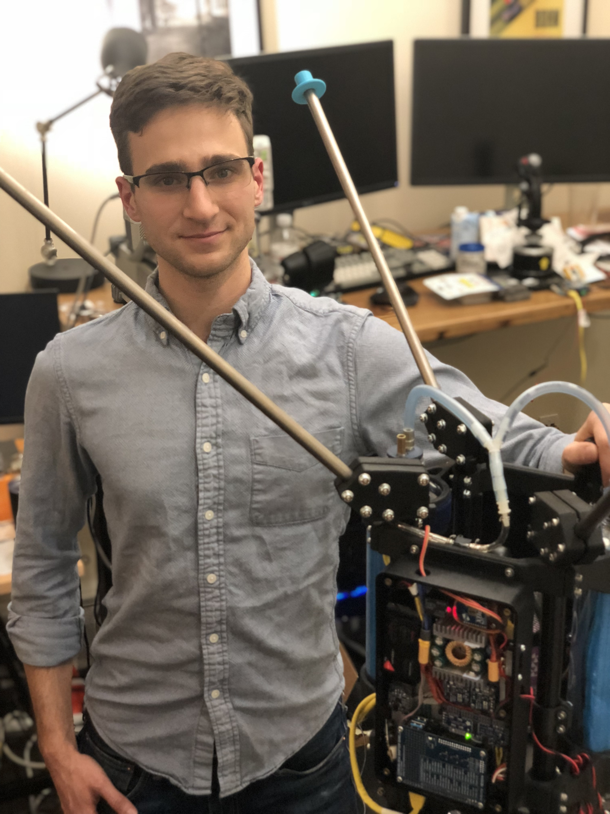

# Matt Vernacchia's Engineering Portfolio

I am currently an Aerospace Engineering PhD student at MIT, where I develop rocket propulsion systems for small, fast aircraft. These aircraft can fly at 1000 km/hr and are 10x smaller than any air vehicle of comparable speed. I simulate combustion and heat transfer, mix solid rocket propellants, fabricate rocket components with metal additive manufacturing, and test-fire solid rocket motors. I built our lab's solid rocket capabilities from a clean sheet.

I love the process of brining difficult technologies from theory to implementation. I have a strong mix of skills in analysis, mechanical design, and software, which I believe make me well suited to a fast-paced R&D environment. 

Finding meaning in my work is important to me. I prefer to work with passionate teams on projects with the potential to bend the density of humanity towards better outcomes.

> Maybe it's a little early - maybe the time is not quite yet - but those other worlds, promising untold opportunities, beckon.

[resume](assets/docs/vernacchia_resume.pdf)

## Education

 - Currently PhD student, Massachusetts Institute of Technology, Dept. of Aeronautics and Astronautics
 - SM, Massachusetts Institute of Technology, Aeronautics and Astronautics, 2017
 - SB, Massachusetts Institute of Technology, Aeronautics and Astronautics, 2015
