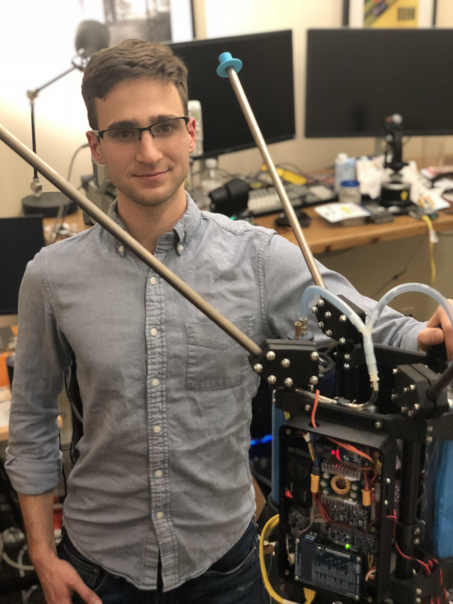

# Matt Vernacchia's Engineering Portfolio

I'm a software engineer excited to build optimization, simulation and analysis tools that help people understand and operate complex systems.
I love making software to push the limits of what physics allows.

Currently, I manage the scientific software team at [Commonwealth Fusion Systems](https://cfs.energy) (CFS),
a MIT[^1] spinout commercializing fusion energy via high-magnetic-field tokamaks.
Our team makes software to design and build superconducting magnets, the key tech behind CFS's fusion device.
We focus on magnets because tokamaks' fusion power output scales with magnetic field to the fourth power.
Using a better superconductor ([HTS](https://en.wikipedia.org/wiki/Rare-earth_barium_copper_oxide)), we make 2x stronger magnets, enabling 16x more fusion power -- enough to exceed energy breakeven.

Our team's software helped scale HTS magnets from bespoke articles that fit on a dinner plate to [a factory building multiple truck-sized magnets/month](https://www.youtube.com/watch?v=4PItOlY6_xE).
Projects we've delivered include:

- An optimizer that allocates ~$100M/year of superconductor to magnets.
- Simulations that accurately predict magnet performance and run in minutes on a laptop (built on our [open-source electromagnetics library](https://github.com/cfs-energy/cfsem-py)).
- Signal processing algorithms that protect multi-$M magnets from "[quench](https://en.wikipedia.org/wiki/Superconducting_magnet#Magnet_quench)" damage.

[^1]: I am also a Visiting Scientist at MIT's Plasma Science and Fusion Center.

Before joining CFS in 2020, I researched rocket propulsion at MIT, earning a PhD in Aeronautics and Astronautics.
I designed, built, and tested solid rocket motors for our lab's research on small, high-speed drones.
To propel a kilogram-scale aircraft at Mach 0.8 (about 1000 km/hour) for several minutes,
I developed an unusually slow-burning solid-propellant rocket ([more about this project](project_pages/firefly.md)).
I loved the hands-on research: we mixed custom propellant chemistries and 3d-printed rocket parts from titanium.
For me, the highlight was test-firing, and occasionally exploding, rocket motors in a concrete bunker under MIT's campus.
Using data from these experiments, we developed differentiable physics models of the aircraft and rocket motor.
This let us rapidly explore and optimize the design space (vehicle + motor + mission trajectory) in software.

During undergrad at MIT, I studied Aeronautics and Astronautics and led the student Rocket Team.
In the summers, I did several engineering internships at SpaceX, including integrating a
[flight simulator](software_projects/#crew-dragon-flight-simulator) for NASA astronauts,
and an internship at JPL prototyping [new human-robot interfaces](publications/#gesture-based-robot-control-with-variable-autonomy-from-the-jpl-biosleeve).
As a young student, seeing these organizations accomplish amazing feats of engineering -- landing rockets and Mars rovers -- was deeply inspiring.
I'm grateful for the brilliant folks I learned from.

Finding meaning in my work is important to me. I prefer to work with passionate teams on projects with the potential to bend the future of humanity towards better outcomes.

---

[resume](assets/docs/resume_vernacchia_2023-04-16.pdf) - [publications](publications.md) - [hardware projects](hardware_projects.md) - [software projects](software_projects.md)

