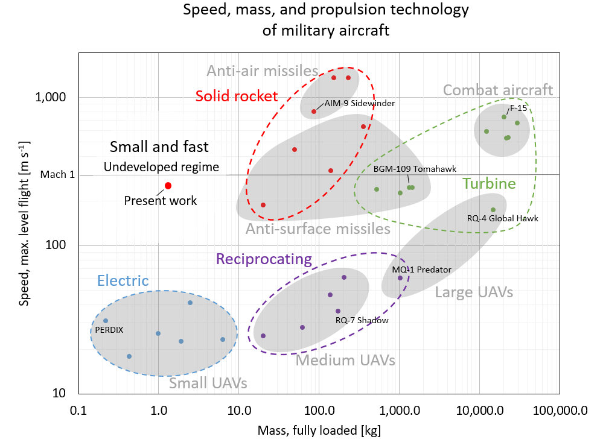
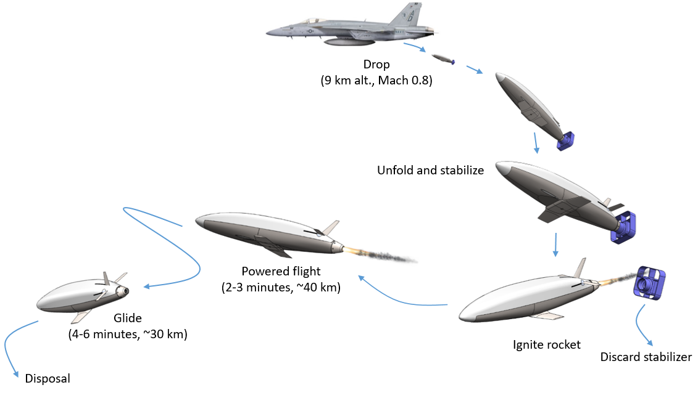
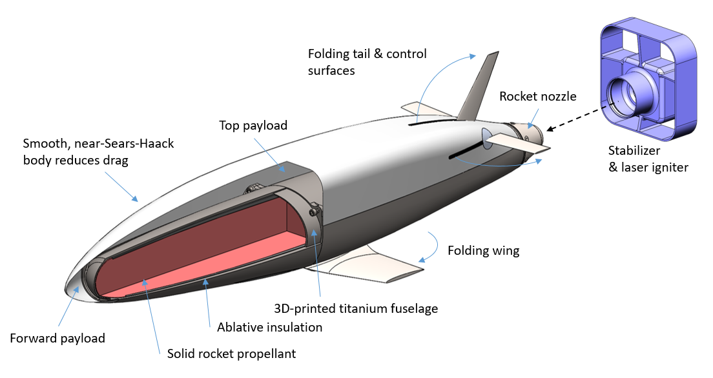
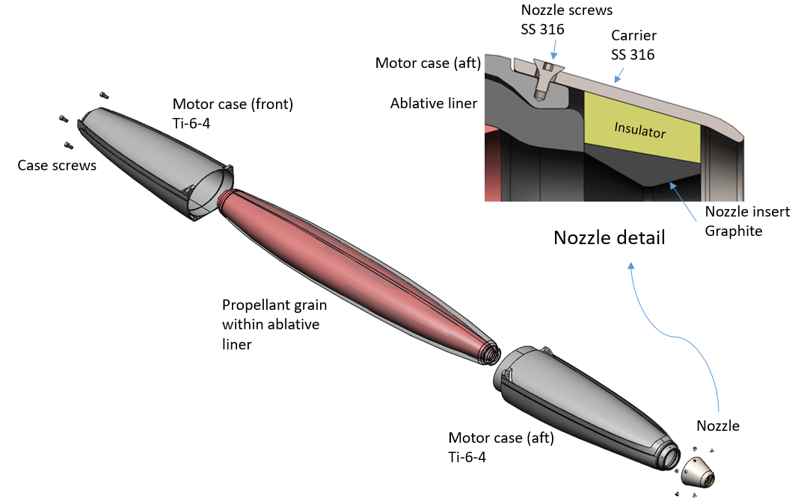
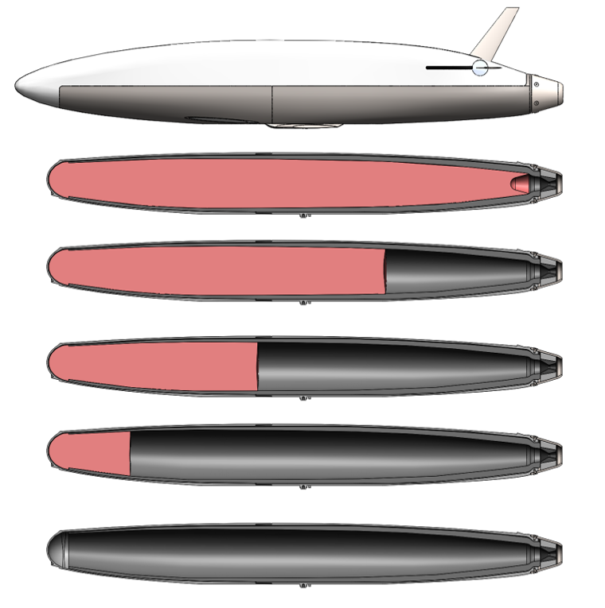
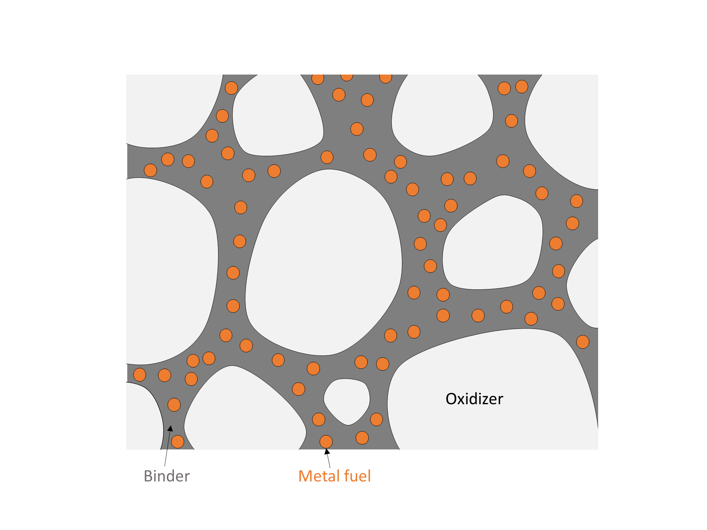
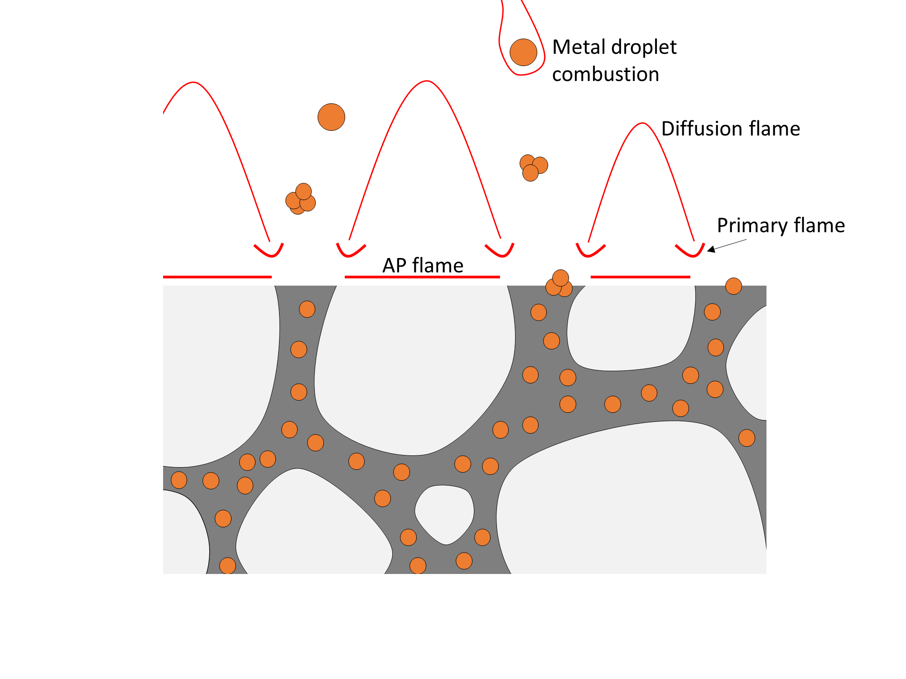
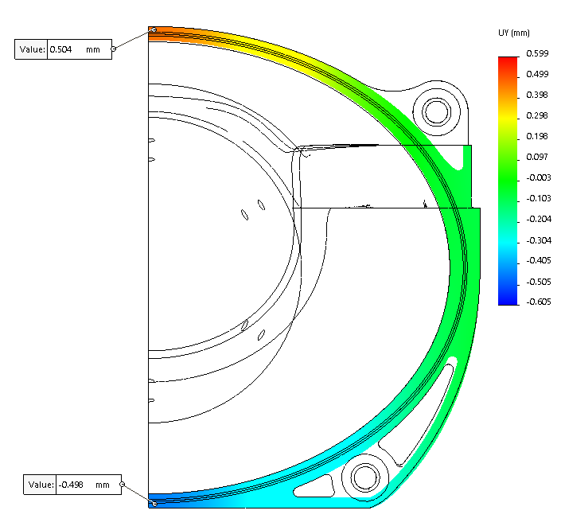
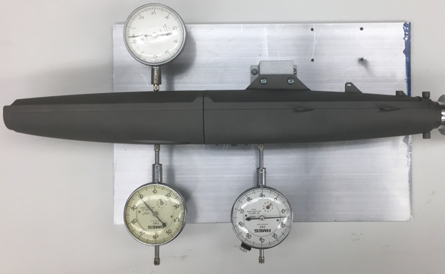
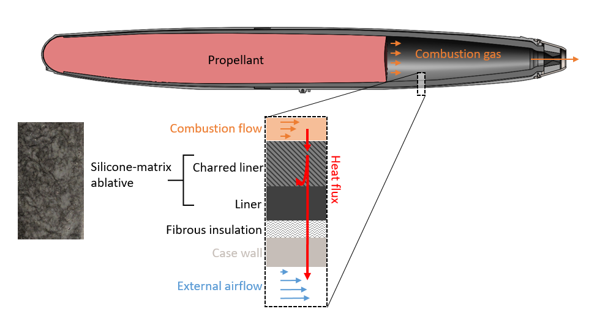

# Rocket-propelled small fast aircraft (Firefly)

*Collaborators: Tony Tao, Jon Spirnak, Kelly Mathesius, Chris Courtin, and Prof. R. John Hansman*
*Sponsored by MIT Lincoln Laboratories and BAE Systems, Inc.*

!!! note ""
    Firefly is a small, fast aircraft which can fly at 1000 km/hr and is 10x smaller than any air vehicle of comparable speed. My PhD research focuses on developing a novel, slow-burn solid rocket propulsion system for such aircraft.

<figure>
    
    <figcaption>Our "artist's concept" of the Firefly aircraft.</figcaption>
</figure>

## Motivation
### The small and fast gap

Small, uncrewed aerial vehicles (UAVs) are expanding the capabilities of aviation. However, a gap exists in the size and speed capability of aircraft: no aircraft are both small (less than 10 kg) and fast (capable of transonic flight). This gap is shown in the figure below, which plots the speed vs. size of representative US military aircraft.

<figure>
    
    <figcaption>The speed vs. size design space currently lacks small, fast aircraft. Data from Jane’s Information Group and manufacturer websites.</figcaption>
</figure>

### Propulsion technology for small, fast aircraft
A small, fast aircraft requires a propulsion system which is both miniature and high-power; requirements which current UAV propulsion technologies do not meet. To meet this need, we are developing a slow-burn solid rocket motor. Solid rocket motors have a high energy and power density (an advantage over battery-electric systems) and are mechanically simple with no moving parts (an advantage over turbojet engines).

## Our research

Our research enables development of small, fast aircraft through technology development and design space exploration:

*Technology development* - We are developing a prototype aircraft, and solving the technical challenges encountered along the way. Examples:
 
 - Formulating new set of slow-burn solid propellants, measuring their burn rate in a [strand burner](strand_burner.md) and rocket motors, and modeling their combustion process.
 
 - Developing nozzles which can withstand the unique thermal challenges of small, long-endurance rocket motors.
 
 - Using metal additive manufacturing to produce rocket motor cases.

 - ...

*Design space exploration* - Aircraft design involves complicated trade-offs between range, speed, size, and other metrics. These trade-offs are different for small, fast aircraft than for typical UAVs. We are documenting and quantifying these trade-offs so that future designers can chose the best configuration for their mission and requirements. An optimization technique called [Geometric Programming](../../software_projects#exploring-aircraft-design-tradeoffs-with-geometric-programming) may be a useful tool in this task.

## The Firefly aircraft concept
Firefly is concept for a 1-2 kg, Mach 0.8 (1000 km/hr) rocket-propelled aircraft. We are currently doing preliminary design and prototyping of the aircraft, and ground-testing the propulsion system.

### Concept of operations
Firefly is meant to launch from a larger (crewed) aircraft at high altitude. It then ignites its rocket motor for several minutes of powered flight at Mach 0.8.

<figure>
    
    <figcaption>A possible concept of operations for a small, fast UAV on an air-launched mission.</figcaption>
</figure>

### Aircraft components and configuration
The vehicle's configuration is based around an integration of a solid rocket motor case into an aircraft fuselage. The vehicle's primary structure is the motor case, which is additively manufactured from a titanium alloy. The fuselage is contoured to reduce drag. The wings and tail feature miniature, high-precision deployment and actuation mechanisms. The major components of the current design revision are shown below.

<figure>
    
    <figcaption>Our candidate design for a small, fast aircraft is built around a slow-burn solid rocket motor.</figcaption>
</figure>

## Rocket motor
Firefly is propelled by a novel slow-burn solid rocket motor. The initial development of this motor and its propellant was the focus of my [Master's thesis](../../publications/#development-modeling-and-testing-of-a-slow-burning-solid-rocket-propulsion-system).

The motor consists of a solid propellant grain,
which is surrounded by an ablative liner, and encased in a 2-part motor case. The motor
case is additively manufactured from a titanium alloy. Upon ignition, the propellant grain
burns from aft to front (an end-burning configuration). This allows for a slow
burn, but exposes the interior of the motor to combustion gases. The ablative liner (black
in these figures) stands between the combustion gases and the metal motor case to protect
the latter from heat.

<figure>
    
    <figcaption>The major components of the Firefly solid rocket motor.</figcaption>
</figure>

<figure>
    
    <figcaption>To achieve a long burn time, the Firefly motor uses an end-burning propellant grain. This sequence shows the expected regression of the propellant grain (pink) during the burn.</figcaption>
</figure>

### Solid propellant
The purpose of solid rocket propellants is to generate hot gas at high pressure. This gas is then expanded through a nozzle and ejected from the rocket motor to provide propulsive force. We use a type of propellant called "ammonium perchlorate composite propellant" (APCP), which contains a solid oxidizer (ammonium perchlorate) and (optionally) a powdered metal fuel, held together by a rubber-like binder. The binder also serves as a fuel, giving off hydrocarbon vapors during combustion. Despite being a *solid* propellant, the majority of the combustion energy release occurs in a *gas*-phase flame above the propellant surface.

<figure>
    
    
    <figcaption>The composition and flame structure of ammonium perchlorate composite propellant.</figcaption>
</figure>

Typical APCP burns too quickly for the Firefly motor, which requires long endurance and low thrust. Our propellant uses a burn rate suppressant to slow down the combustion process. Part of our research is modeling and testing the effects of this burn rate suppressant.

### Motor case

The motor case is produced from Ti-6Al-4V via additive manufacturing. This production technology allows us to contour the case to reduce drag, and to include mounting features for the wing, tails, nozzle and payload.

<figure>
    
    <figcaption>Motor case halves on the build platform after printing.</figcaption>
</figure>

Interestingly, the motor case is a stiffness-limited structure. Packaging constraints forced the motor case to have an elliptical cross section. When pressurized, it will tend to "squash" into a circle. If the case deforms to much, it will tear the propellant grain, which could cause the motor to fail. Thus, the case must be sufficiently stiff. We assess this with finite element simulations and hydrostatic tests.

<figure>
    
    
    <figcaption>Finite element analysis (left) and hydrostatic tests (right) to measure the stiffness of the motor case.</figcaption>
</figure>

If we were to relax some of the packaging constraints, we could use a circular tube motor case, which would be much simpler and cheaper. this would come at the cost of higher drag (--> shorter range) and more restricted payload mounting. This trade-off will be revisited in future iterations.

### Ablative liner

Thermal protection is particularly challenging for small, slow-burn solid rockets because of
their end-burning grain configuration and long burn time. The end-burning grain causes
the interior of the case to be more exposed to combustion gases. This interior
surface must be protected by an ablative liner. It is desirable to make this liner as thin as
possible: it adds inert mass to the vehicle and takes up volume which could otherwise be
allocated to propellant. Thus, it is important understand the ablation process, and make a
good selection of the ablative material.

<figure>
    
    <figcaption>An ablative liner protects the inside of the motor case from hot combustion gases.</figcaption>
</figure>

### Nozzle
The combination of small size and long duration is difficult for nozzle design. Most small
nozzle designs rely on heat sinking effects, and would fail after tens of seconds of operation.
In contrast many large, long duration nozzles (e.g. on the Shuttle Reusable Solid Rocket
Motor) are ablatively cooled. However, the amount of ablation recession does not change
with nozzle size, and recession would result in unacceptably large (fractional) changes in the
nozzle contour and throat area of a small nozzle. New designs are needed.

We are prototyping and testing new nozzle designs. [This page](nozzle_adapter.md) describes a the design and production of a component used in these tests.

*Copyright 2019 Matthew Vernacchia and Massachusetts Institute of Technology*
