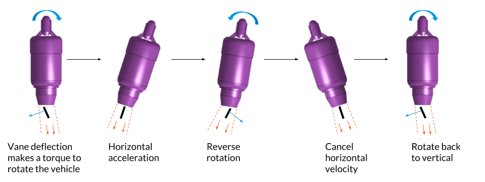
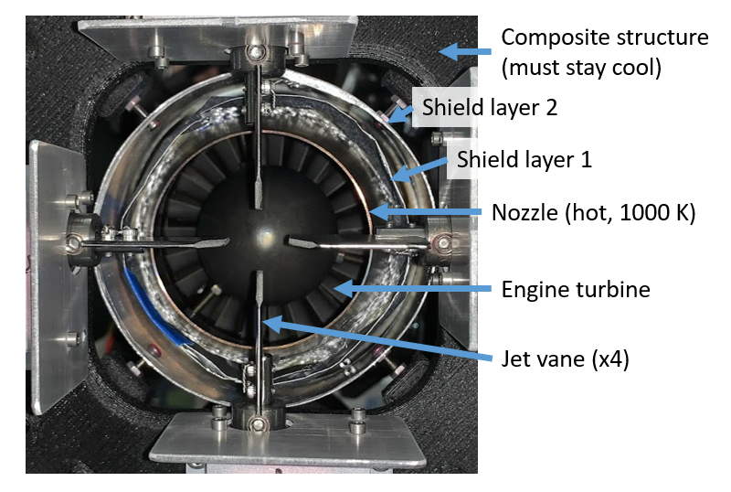
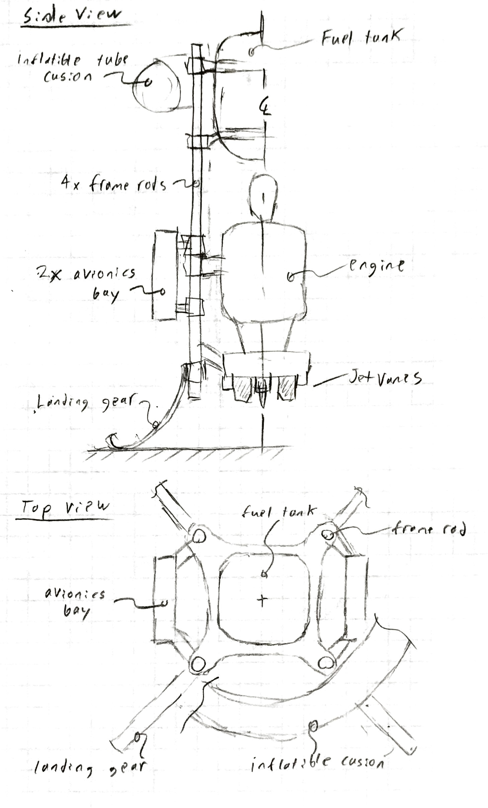
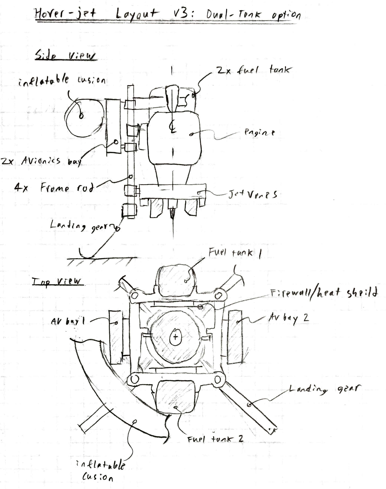
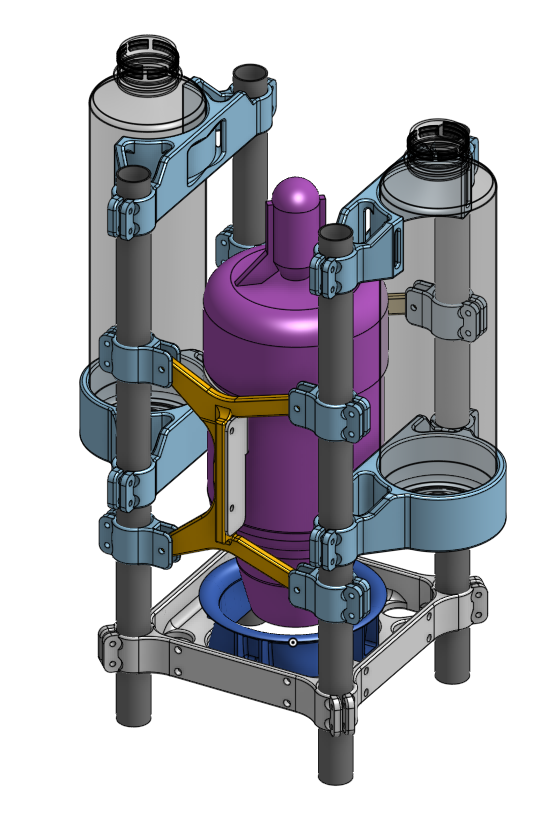
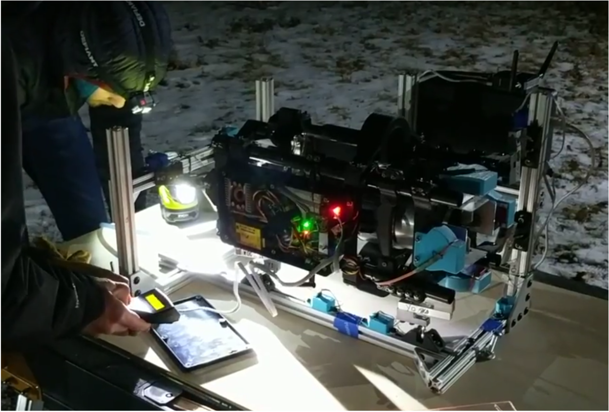
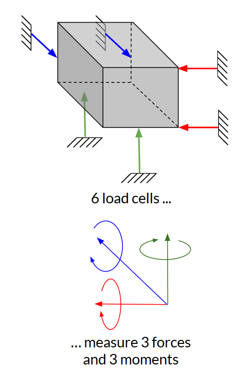

# Hoverjet

*Collabrorators: Jacob Panikulam, Benjamin Kroop, Mason Turner, Isaac Dykeman & others*

!!! note ""
    Hoverjet is a jet-powered, vertical-takeoff-and-landing aircraft. I designed the airframe and control mechanisms, and led the fabrication and assembly of the vehicle.

*This is a work-in-progress as of March 2019.*

<figure class="center video">
    

      <iframe width="560" height="315" src="https://www.youtube.com/embed/Ia_bQmQX-PA?rel=0" frameborder="0" allowfullscreen></iframe>
    

    <figcaption>Starting up Hoverjet's jet engine on our 6-axis thrust stand. The four stainless steel vanes in the jet exhaust can be actuated to steer the aircraft. This test measures the forces and torques produced by the jet and vanes.</figcaption>
</figure>

## Overview
Hoverjet is an educational project than I am building with few friends (who work in the robotics industry). They wanted to play around with new algorithms for state estimation and control of hovering vehicles. Rather than building a conventional quadrotor, we decided to make a jet-powered vehicle that is controlled via thrust vectoring. This better mimics the dynamics of some interesting systems, like propulsive landing spacecraft. (and having a jet engine to play with made the project more fun).

We started designing Hoverjet in the fall of 2018, and met up in Pittsburgh for two weeks over winter break to build the vehicle and begin developing its software. The team in Pittsburgh has done successful static tests, and we are hoping to fly soon!

<figure class="center video">
    

      <iframe width="560" height="315" src="https://www.youtube.com/embed/M27FfXg9k8k?rel=0" frameborder="0" allowfullscreen></iframe>
    

    <figcaption>A timelapse of the team assembling Hoverjet's airframe.</figcaption>
</figure>

### Thrust vectoring concept
The vehicle controls itself by using vanes in the jet's exhaust stream to change the direction of the thrust vector. The thrust-vectoring concept is illustrated in the figure below, which shows a toy example of translating the vehicle to the right. In order to translate to the right, the vehicle must first tip itself to build horizontal velocity, then tip back to cancel the horizontal velocity and come to rest in a new position. The system is neutrally stable, so a closed-loop control system must constantly make small corrections to keep the vehicle on the desired trajectory.

<figure>
    
    <figcaption>Example of thrust vector control: translation to the right. The jet is illustrated in purple and the vane in black. This 2D example has one vane; the 3D vehicle has four vanes in an 'x' pattern.</figcaption>
</figure> 

## Airframe design

*You can view the CAD model of Hoverjet [on Onshape](https://cad.onshape.com/documents/eeb6df3e4d498ea4a465e30e/v/7283e47d24d7009d197cf654/e/00a5e3dae29f1d99065adad7)*

The airframe needs to hold the jet engine, fuel tanks, avionics enclosures, and jet vane units. The aircraft's mass must be balanced around the center of the jet engine, and must remain balanced as fuel is consumed. Because this is a prototype/testing aircraft, the airframe needs to be reconfigurable (e.g. if we decide to add or move sensors). The aircraft needs to be robust to crashes, and it should be easy to replace components if they break or need to be upgraded.

<figure>
    
    <figcaption>This CAD 3-views shows mounting locations of the aircraft's critical components.</figcaption>
</figure>

I addressed these requirements with a modular design. The main structure is four carbon-fiber frame tubes surrounding the engine. All components are held by 3D-printed brackets which clamp on to the frame tubes. Components can be added or relocated by adjusting the bracket locations or printing new brackets. Maintenance is easy: only a single hex key is needed to remove any component (all fasteners are #6 SHCS), and the frequently-accessed avionics bays are on the outside of the vehicle.

The vehicle is designed to be crash tolerant: The landing legs are sized to absorb a 5 m/s crash from any direction. The most expensive component, the engine, is "caged" by the rest of the structure. The fuel tanks are filled with a open-cell foam, which prevents sloshing and limits severity of a fuel spill if the tanks are ruptured (a technique borrowed from auto racing).

### Additive manufacturing
We needed to build and maintain the aircraft in my friend's home machine shop. He does not have CNC cutting machines, so I designed most of the geometrically complicated parts to be made via 3D printing (filament deposition). Below is a time lapse of his Prusa i3 mk3 printing the main frame which holds the jet vanes and frame tubes. The material is a nylon filament filled with chopped carbon fiber (from 3DXTECH). Compared to typical filament plastics (i.e. ABS), it is stronger, stiffer, and maintains it strength up to a higher temperature.

<figure class="center video">
    

      <iframe width="560" height="315" src="https://www.youtube.com/embed/FzrSr3ATOFE" frameborder="0" allow="accelerometer; autoplay; encrypted-media; gyroscope; picture-in-picture" allowfullscreen></iframe>
    

    <figcaption>Time lapse of printing the main frame.</figcaption>
</figure>

### Infrared radiation shield
One interesting feature of the airframe is the IR radiation shield. This reduces the radiative heat transfer from the jet nozzle to the surrounding structural components. These components are composite, and will weaken if they get above 350 K. The nozzle is only a few cm from these components, and will reach 1000 K, hot enough to emit a significant amount of thermal radiation (radiative power $\sim T^4$). To reduce radiative heating of the structure, I surrounded the nozzle with a two-layer radiation shield made of aluminum. Infrared radiation from the nozzle must be absorbed and re-radiated by each layer before reaching the structure. The layers are separated by fiberglass cloth to prevent contact and thermal conduction between the layers. This design is vaguely similar to the multilayer insulation used on spacecraft.

The shield works - during static tests we have run the engine at full throttle for several minutes without any damage to the surrounding structure.

<figure>
    
    <figcaption>A view looking up into hoverjet from below shows the radiation shield surrounding the engine nozzle.</figcaption>
</figure>

### Design ideation process
We started by discussing the goals and requirements as a team. Crash tolerance and modularity/maintainability were the key concerns. I then though about manufacturing constrains - how much money were we willing to spend, what tools were available in my friend's shop, how much of the vehicle could I make on campus and bring with me?

After establishing this context, I made a few design sketches (see below) and discussed them with the team. We selected the dual-tank configuration.

<figure>
    
    
    <figcaption>Preliminary sketches of two configuration options.</figcaption>
</figure>

I then asked the team to select or specify dimensions for the major components. I made a rough-cut CAD assembly to make sure all the major components fit. After reviewing this with the team, I preceded to the detailed mechanical design.

<figure>
    
    <figcaption>Rough CAD model to check fit of major components.</figcaption>
</figure>

Throughout the entire process I kept a mass budget of the vehicle, which I refined as the design matured. The final design came in slightly under the initial mass prediction (9 kg vs 10 kg).

## Jet vane control mechanism
Hoverjet has four Jet Vane Units which provide control over the vehicle. The vanes are mounted in the exhaust of the jet in an 'x' pattern. Rotating the vanes deflects or swirls the exhaust jet, which applies forces and torques to the aircraft. By actuating different combinations of the vanes, we can produce all three torque components (roll, pitch, and yaw).

Each Jet Vane Unit consists of a vane, a servo which actuates the vane, a gear train connecting the servo to the vane, and a body and housing. The bodies were rather complicated, so I outsourced the machining to Protolabs (a rapid-prototyping shop). The other components I machined on-campus or 3D printed. In order to resist the exhaust temperatures, the jet vanes are made from AISI 316 stainless steel. The vanes have held up well to several minutes of operation at full throttle (although the heated portions have developed a beautiful rainbow oxide pattern). The figure below shows the four assembled Jet Vane Units ready to be inspected, tested and installed on the aircraft.

<figure>
    
    <figcaption>Jet Vane Units.</figcaption>
</figure>

I sized the vanes using a rough model of the aerodynamic forces on a flat plat. Compensating for a misalignment of the center of mass turned out to be the driving case for the vane size. My vane sizing worksheet is available [on github as an Ipython notebook](https://github.com/build-week/hover-jet/blob/feature/start-design-scripts/design-scripts/jet_vane_design.ipynb) (TODO: some of my notes are still on paper and have not been typed into the ipython notebook :( )

I determined required servo speed using a linearized model of the aircraft dynamics. Typically, the required actuator bandwidth would be set by the natural frequencies of a system, but hoverjet does not have any natural frequency (the linear dynamics are just 4 poles at the origin). Instead, the servo speed is set my the required position control resolution. If the vane cane be moved faster, we can drive smaller position oscillations. My servo speed worksheet is available [on github as an Ipython notebook](https://github.com/build-week/hover-jet/blob/feature/start-design-scripts/design-scripts/jet_vane_speed.ipynb)

## System identification

Before flying Hoverjet, we need to calibrate the response of the vehicle dynamics to control inputs (System Identification). Specifically, we want to know how the forces and torques applied to the vehicle vary with vane angles and engine throttle setting. A dynamics model derived from this information is used by Hoverjet's Model-Predictive Controller.

To make these measurements, we made a thrust stand capable of measuring all 3 forces and 3 torques on the vehicle. This could be done by a 6-axis load cell, but those cost many thousands of dollars. Instead, I built a thrust stand which measured the forces an torques using a kinematically exact arrangement of 6 one-axis load cells. These load cells cost $10 each, and the remaining hardware and aluminum extrusion for the stand totaled $600. Kinematically exact constraint is a nifty design principle;  a good introduction can be found in [Ch 2.6 of Dr. Layton Hale's PhD thesis](https://dspace.mit.edu/handle/1721.1/9414).

<figure>
    
    
    <figcaption>Left: Hoverjet mounted horizontally on the Thrust Stand. Right: thrust stand uses a kinematically exact arrangement of 6 load cells to measure 3 forces and 3 torques produced by the jet and vanes.</figcaption>
</figure>

We discovered an important bug during hardware-in-the-loop testing on the Thrust Stand: the magnetic field from the jet engine's fuel pump motor interfered with the navigation system's magnetic compass. This bug would have resulted in a crash had if we had not caught it before flight testing.
