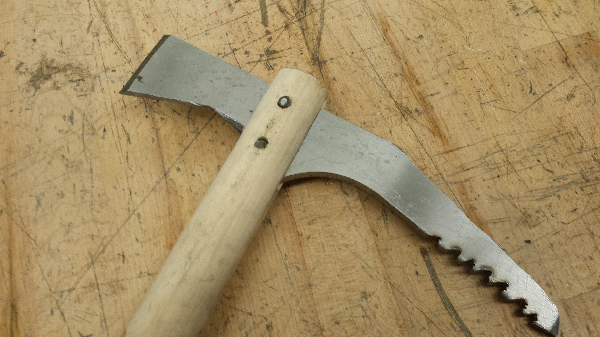

# Ice ax

!!! note ""
    I built my own ice ax for a trip to Mt. Washington. The ax is constructed from steel and poplar, and is reinforced with composites. I spent a few hours designing and building the ax, with the goal of practicing metalworking and composite layups.

## Design
The ice ax has a 14 cm pick and a 70 cm handle. I sized the handle length to match the distance between my palm and ankle, the recommended size for mountaineering axes. The pick and the shaft form a 70 degree angle, which is typical for mountaineering axes (technical climbing tools use a steeper angle of 50 to 60 degrees).

The head and spike are made from steel. Typical ax materials are steel, titanium and aluminum - I chose steel because titanium was too expensive, and aluminum would be too soft. I have no idea what alloy the steel is, it was a piece of scrap I found lying around in the shop.

The head and spike are attached to the shaft by slotted joints held in place by 6.4 mm (0.25 inch) steel pins. The joints are then tension-wrapped with unidirectional carbon fiber tow to prevent the wood slot from splitting. Finally, the joints are wrapped in fiberglass tape to provide additional strength and to protect the carbon fiber from abrasion. (The fiberglass abrasion protection is inspired by a few firefighting COPVs I've seen).

*Sketches of the ax from my design notebook.*

## Fabrication
I cut the outline of the head from steel stock on a bandsaw. I then cut teeth into the pick with an angle grinder, and sharpened the tip and adze on a bench grinder. I cut the slots and pin holes into the wood, and used an arbor press to insert the pins.
The vacuum bag.

Next, I did the carbon fiber wrap. I then overwrapped with fiberglass tape, and wrapped the handle with fiberglass cloth. I used using West Systems 105/209 epoxy for the layups. Next, I vacuum-bagged the layup to remove excess epoxy and press the tape wrap into the head-shaft joint.

*The carbon fiber tension wrap around the head joint.*

*The vacuum bag*

## Results
The design and fabrication took 5 hours. The finished tool weights 780 g, which is on the heavy side of the typical range. I tested the tool (in a non-safety critical role) during a hike up Mt. Washington, and it performed well.

*At the summit of Mt. Washington. I'm second from the left.*