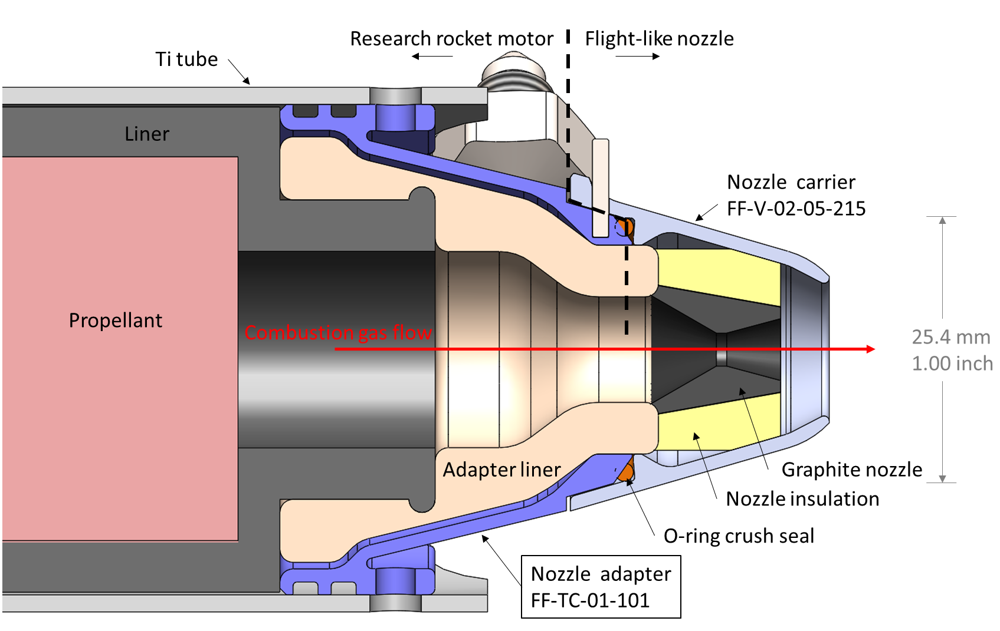
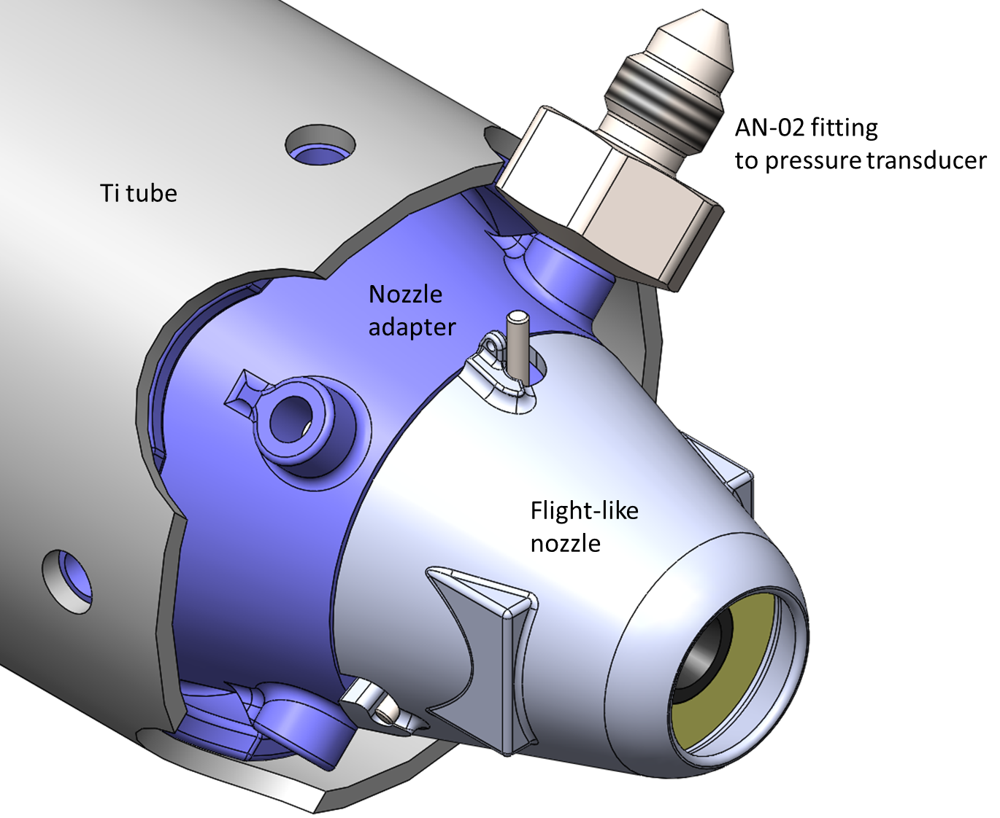
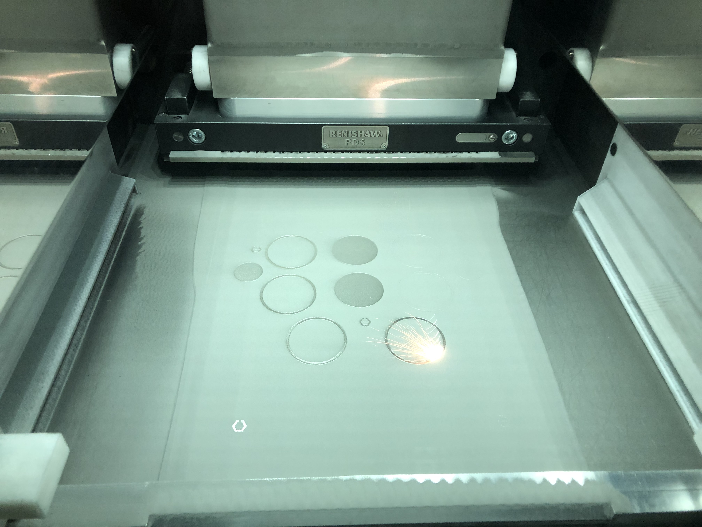
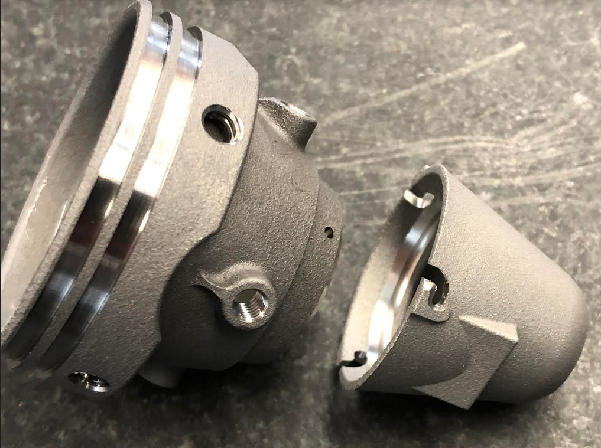
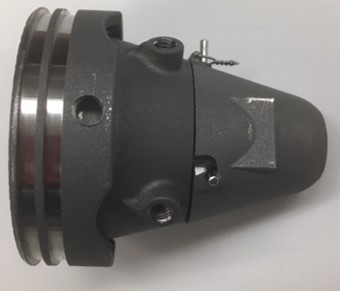

# Additively manufactured titanium rocket component

*Collaborators: Kelly Mathesius (MIT), Carl Hamann (Renishaw plc.)*

!!! note ""
    This is a component of our research rocket motor which I designed and which is manufactured by Renishaw plc. It illustrates my experience interacting with a manufacturing shop and using GD&T to communicate in drawings.

<figure>
    
    <figcaption>Engineering drawing of the component.</figcaption>
</figure>

## Context and interfaces

This part enables us to test miniature rocket nozzles on our research rocket motor. The rocket propelled aircraft we are developing requires a nozzle with insulation that can withstand exposure to hot combustion gases for several minutes - a challenging design that must be prototyped and tested. This adapter mimics the mechanical interface on the aft end of the aircraft's motor case, allowing us to mount the flight-like nozzle onto our research rocket motor. Thus, we can flow combustion gases through the nozzle to test its performance.

<figure>
    
    
    <figcaption>The nozzle adapter (purple) in its assembly context.</figcaption>
</figure>

## Material selection

The adapter is made from Ti-6Al-4V ELI, a titanium alloy. It is produced from metal powder via powder bed fusion additive manufacturing. The material and manufacturing process are the same as the motor case which the adapter is meant to simulate. This is important so that the adapter is an accurate check for issues with finish, strength at elevated temperatures, thermal expansion, etc.

## Analysis

After designing the part, I performed finite element analysis (FEA) to check the expected stresses in the part. A separate analysis of heat transfer through the ablative liner predicted that the maximum temperature of this part would be 700 K. In the FEA, I used material properties for Ti-6Al-4V adjusted to this temperature (I looked these up in [MMPDS](https://mmpds.org)).

I used the built-in FEA package in SolidWorks to perform the analysis. To reduce the computational cost, I took advantage of the 4-fold symmetry of the part and only simulated one quarter with periodic boundary conditions.

At the design pressure of 1.9 MPa, the factor of safety (yield tensile stress / max von Mises stress) was greater than our required value of 1.5.

## Outsourced manufacturing

The on-campus machine shop does not have equipment for metal additive manufacturing or machining titanium. We outsourced this part to Renishaw plc., which manufactures metal AM systems and offers AM + machining services.

I began the discussion with Renishaw by sending a preliminary model of the part and a description of the context in which it would be used. Carl Hamann from Renishaw discussed the design-for-manufacturing concerns. We decided the best way to to manufacture the part was to print a near net shape, and then machine precision features on a CNC mill. We also identified a few modifications which made the design easier to produce on their machines and tools. This process was smooth, as we have previously ordered several parts from Renishaw and developed a good relationship.

Then, I prepared an engineering drawing of the part (see figure at top of article). I also prepared two 3D models: one of the "as printed" near net shape, and one of the final geometry after printing. Mr. Hamann used these files to program the AM system and mill.

<figure>
    
    <figcaption>The parts being sintered in Renishaw's additive manufacturing system.</figcaption>
</figure>

## Fit check and next steps

Renishaw first manufactured one instance of the part and sent it to us for a fit check. The nozzle adapter's "bayonet fitting" fit well onto the nozzle (see figure below).

However, the o-ring grooves were too shallow, and so the adapter could not be installed into the motor without cutting the o-rings. The cause of the error has been identified, and we expect to receive and fit test a new part in the coming week (as of 2019-04-01).

<figure>
    
    
    <figcaption>The first parts assembled for a fit check.</figcaption>
</figure>

Once the part passes the fit check, we will perform a hydrostatic pressure test to check for leaks and verify that the assembly does not yield under the (margined) pressure load. We will then put the part on our rocket motor and fire it!
