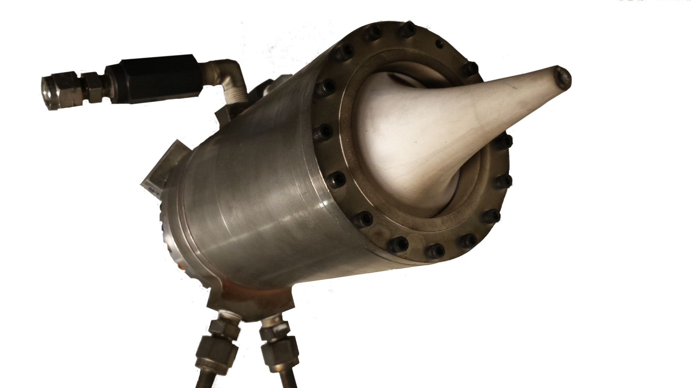

# Pyralis rocket engine

*Collaborators: James Logan, Connie Liu, Andre Kessler, Sam Judd, Jeff Mockleman & others*

!!! note ""
    I led the development of a 2 kN thrust, ethanol / nitrous oxide, pressure-fed rocket engine with an aerospike nozzle.

Pyralis is a liquid-bipropellant rocket engine created by the [MIT Rocket Team](http://rocketry.mit.edu/). I lead the development of Pyralis as Team President (2013-14) and Propulsion Lead (2014-15). The engine burns ethanol and nitrous oxide, and produces 2 kN of thrust at a chamber pressure of 8 MPa. The nozzle is an altitude-compensating aerospike made from machinable alumina ceramic. The combustion chamber is uncooled, and is made from 316 stainless steel insulated with zirconia ceramic.

## Design

Our rocket design process started by defining our goals an requirements. We wanted to use the engine to launch a rocket to 10,000 ft in the Intercollegiate Rocket Engineering Competition (IREC), a goal we ultimately did not achieve. We also wanted to learn and inspire our teammates with the project - Rocket Team needs a compelling and exciting project to keep its members coming.

One of our first design tasks was to select the propellants. The need to operate in the Utah desert for IREC motivated the use of storable (not cryogenic) propellants. We selected ethanol and nitrous oxide because it is a low-toxicity and available combination of storable propellants.

We selected the aerospike nozzle because of our educational and inspirational goals. The aerospike is an advanced nozzle technology that offers improved specific impulse compared to a conventional de Laval nozzle. In retrospect, I think choosing the aerospike was overly ambitious, but it certainly did get people excited about rocket team!

<figure>
    
    <figcaption>Components of the Pyralis engine</figcaption>
</figure> 

We then developed the hardware via an iterative process. We first build a cold gas testbed to practice working with fluid systems and verify our nozzle design algorithm. We then designed, built and tested a prototype engine, which went through two major design iterations between March 2014 and January 2015.

The following sections describe the design process for the injector and combustion chamber.

### Injector
The injector is uses a triple-impinging jet pattern. The injector is assembled from 3 plates of 316 steel - the bottom plate contains the injector orifice holes, the middle plate forms 2 annular channels to distribute fuel and oxidizer to the orifices, and the top plate closes the channels and provides attachment points for the thrust frame. Copper gaskets seal between the plates. In addition to distributing propellant, the injector has pass-thoughs for a pressure tap, temperature sensor and the ignition system.

<figure>
    
    <figcaption>Fuel (orange) and oxidizer (green) flow though the triplet injector. Note this figure shows an o-ring seal; the seal design was later changed to use copper gaskets.</figcaption>
</figure> 

The injector was originally designed by Jeff Mockleman. His design used swirl-flow orifices which achieved very good mixing. However, the swirl orifices were difficult to manufacture accurately, so the tolerance on the orifice area was poor. Water flow tests showed that the area tolerance caused our pressure drop and mass flow rate to be unacceptably far from their design values. To remedy this problem, Connie Liu and I redesigned the injector to use drilled hole orifices in a triplet configuration. The drilled holes could be manufactured to much tighter tolerance that the previous design. Further water flow tests validated the new design.

<figure class="center video">
    

      <iframe width="560" height="315" src="https://www.youtube.com/embed/Y7Ui4Hz6x9Q?rel=0&amp;showinfo=0" frameborder="0" allowfullscreen></iframe>
    

    <figcaption>A water flow test of the re-designed injector. Video editing by Andre Kessler.</figcaption>
</figure>

I also performed a thermal analysis on the injector. I used Nusselt number techniques to estimate the heat transfer coefficients between the injector and the combustion chamber gases, and between the injector and the liquid propellant flows. These heat transfer coefficients provided boundary conditions for a finite element heat transfer simulation (SolidWorks Simulation). The results of the steady-state thermal analysis indicate a maximum temperature of 1400 K. This is slightly above the operating limit (1170 K) of the injector's steel alloy, indicating that the injector is not suitable for steady-state operation. However, during the short burn time (15 s), the engine does not reach steady state. A more detailed transient thermal analysis should have been performed, but we did not have the computational resources at the time.

<figure>
    
    <figcaption>Temperature distribution in a cross section of the injector in steady-state operation.</figcaption>
</figure> 

### Combustion chamber and nozzle
The Pyralis engine’s combustion chamber and convergent nozzle region are contained by a cylindrical structural wall made from 316 steel. Chemical equilibrium analysts predicts a combustion temperature of 1900 K, well above the maximum operating temperature of 316. Therefore walls of the combustion chamber must be thermally protected. We chose an insulating thermal liner, which offers greater simplicity that regenerative cooling, and better re-usability than ablative cooling.

<figure>
    
    <figcaption>A view of the Pyralis engine showing the ceramic nozzle.</figcaption>
</figure> 

The thermal liner consists of a cast zirconia ceramic, which has high temperature tolerance and low thermal conductivity. The steel wall is protected partially by the thermal resistance of the liner, and partly by its heat capacity. This thermal design cannot withstand steady-state operation, but our mission requires a relatively short (15 s) burn time.

<figure>
    
    <figcaption>A CAD rendering cross section showing the nozzle support structure.</figcaption>
</figure> 

The nozzle's spike is made from machinable alumina ceramic. Machinable alumina was selected because of its higher strength and better fabrication tolerances (compared to the cast zirconia used in the liner). James Logan designed a clever web structure to support the nozzle spike within the combustion chamber. I designed the spike's contour using a method of characteristics algorithm.

<figure>
    
    <figcaption>Transient thermal analysis of the combustion chamber wall.</figcaption>
</figure> 

## Testing

<figure>
    
    <figcaption>Rocket team members pose with the engine and test stand before our first static firing. Our faculty advisor, <a href="https://aeroastro.mit.edu/paulo-lozano">Prof. Lozano</a> stands to the left. James Logan and Ryan Webb wear fire-resistant personal protective equipment, as they will fill the propellant tanks.</figcaption>
</figure>

We tested the engine in a blast chamber in MIT's Gas Turbine Lab. The test stand structure was built from steel uni-strut and reinforced with steel cable. Plywood was used to create mounting panels for valves and tanks; the wood was treated with a flame retardant to reduce the risk of unwanted fire. The engine's exhaust was cooled by a water sprayer, and then routed through a J-shaped steel duct to a vent fan in the room's ceiling.

Together with other team members, I developed safety plans and procedures for the static firing. We researched toxicity, fire and explosion hazards, reviewing papers about test facilities for similar engines operated by JAXA and NASA. We then revised our plans through discussions with the Environment, Health and Safety department (EHS) and experienced tab technicians. We created impact/probability charts to document the hazards present in the test, and selected mitigation strategies. Finally, we wrote and practiced a detailed checklist for the test. The checklist covered the nominal procedure, and also contained various abort procedures to return the system to a safe state after a failure.

We performed our first static firing attempt in May 2014. This test failed due to a hard start, which destroyed parts of the combustion chamber and some plumbing. On this version of the engine, the ignition system was a simple spark plug sticking into the combustion chamber, and our propellant flow was controlled by non-throttleable solenoid valves, which open to full flow in 30 ms. Writing now, with several more years of experience and grad classes in combustion under my belt, it seems obvious that this poor design would hard-start. But sometimes I end up learning things the hard way.

<figure>
    
    
    <figcaption>Video stills from the hard start during the May 2014 static fire. At t=0, the spark plug and solenoid valves were energized. At t=+66 ms (top frame), the valve opening and pipe flow transients have passed, and the full propellant flow is passing though the injector. However, the propellant has not ignited, and a strong jet of unburnt propellant mist flows out of the nozzle.
    At t=+99 ms (bottom frame), ignition occurs. Because the fuel and oxidizer are still liquids in the combustion chamber, their density is high and large mass of propellant is in the combustion chamber. When this mixture ignites, a huge amount of energy is released (~1 MJ). The chamber pressure spikes. The incompressible liquid propellants transmit the pressure shock to the engine and plumbing structure. The hose supplying oxidizer to the engine explodes. Glowing wires from the hose’s metal braid can be seen flying away. The pressure exerts a strong downward force on the spike, which structurally fails and is ejected downwards out of the engine.</figcaption>
</figure>

In response, we spent the summer and fall of 2014 redesigning and rebuilding the engine. We developed a hydrogen / air pilot torch to replace the spark igniter and redesigned the injector. We also built our own servo-controlled throttle valves so we could ramp up the propellant flow more gradually.

We tested the new engine in December 2014. Our hard-start remedies were successful - the engine started smoothly! However, it flamed-out after a few seconds of operation. We believe that the $L^*$ of the combustion chamber (about 0.7 m) was too short to maintain stable combustion of the propellants.

<figure class="center video">

  <iframe width="560" height="315" src="https://www.youtube.com/embed/fnRJ-U3l2fM?rel=0&amp;showinfo=0" frameborder="0" allowfullscreen></iframe>

<figcaption>A static firing of the Pyralis engine. We fired our pilot torch (air and hydrogen) for 20 seconds before flowing our main propellants. The engine ignites at about 22 seconds according to the timestamp in the video. Video editing by Connie Liu.</figcaption>
</figure>

## Conclusion

Unfortunately, we had to cancel the project before we could achieve a full-duration static fire. In a subsequent test in January 2015, we accidentally damaged the blast chamber's ventilation system. Previous maintenance had replaced the room's vent fan with a non-explosion-proof fan. When one of our tests vented unburnt propellant vapor though the fan, a spark from the motor ignited the vapor, and the resulting explosion destroyed the fan. Connie Liu and I conducted a thorough investigation into the incident. Among other analyses, I used the Weibull formula to predict the overpressure from a propellant vapor explosion, and found that this overpressure matched the observed structural damage.

Because building we were testing in was scheduled for renovations in a few months, MIT decided not to repair the vent. We had lost our test site, and only had a few months remaining before our project deadline (we were planning to fly the engine at the Intercollegiate Rocket Engineering Competition (IREC) in June 2015). Therefore, we decided to cancel further development of Pyralis, and switched to a commercial-of-the-shelf solid rocket motor for IREC 2015. Difficult as it was to make, this ended up being the right call. With the extra manpower freed up from the propulsion system, the team built an excellent rocket and recovery system, which won the basic category of IREC.

Although it was disappointing to cut the project short, we learned much from what we were able to accomplish. I loved playing mentor to my younger teammates, and using the project to inspire their excitement about engineering and propulsion. Almost everyone involved has gone on to apply what they learned on Pyralis to other propulsion projects at MIT, SpaceX, Firefly, NASA, ULA, and Northrop Grumman.

<figure>
    
    <figcaption>MIT Rocket team's 2015 rocket launches in the IREC competition. Unfortunately, we did not finish the Pyralis engine in time, and flew this rocket on a off-the-shelf solid rocket motor instead. Despite this change, the team built an excellent rocket and won first place in the competition.</figcaption>
</figure>
