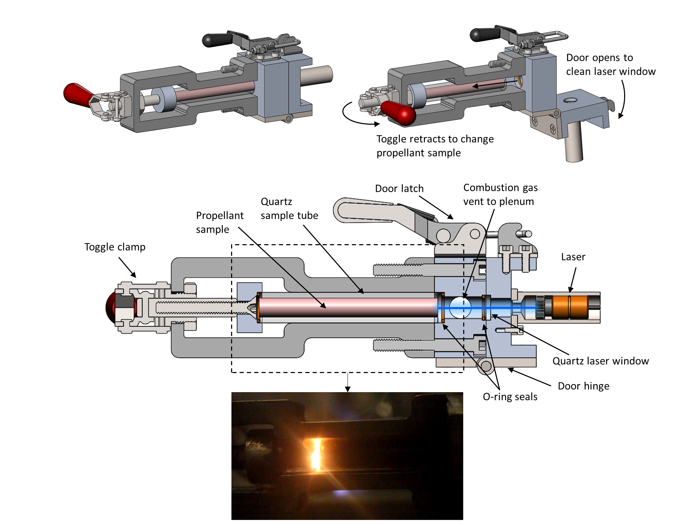
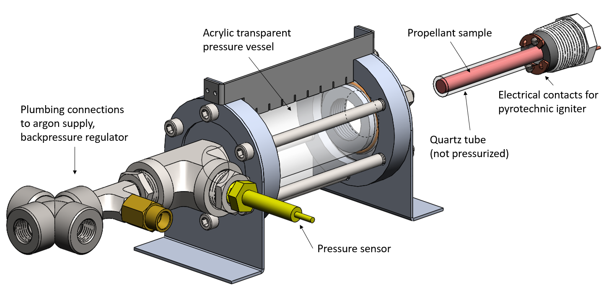

# Strand burner for solid propellant testing

*Collaborator: Tony Tao*

!!! note ""
    As part of my Master's research, I designed and built a device to measure the burning rate of solid rocket propellant at elevated pressure. I improved the device though 4 iterations.

<figure class="center video">
    

      <iframe width="560" height="315" src="https://www.youtube.com/embed/Mh8e3psMqQU?rel=0&amp;showinfo=0" frameborder="0" allowfullscreen></iframe>
    

    <figcaption>A strand burner test played back at 4x speed.</figcaption>
</figure>

## Motivation

One of the key steps in the development of a new solid rocket propellant is to characterize the burn rate as a function of pressure. The burn rate ($r$) versus pressure ($p$) relationship is typically modeled by Vielle's Law:

$$r = a p^n$$

where $a$ and $n$ are parameters which must be determined experimentally.

These experiments are performed with a strand burner, a device which burns small samples (“strands”) of propellant at a controlled pressure and measures their burn rate.

## Final design
The design goals for the strand burner were to allow rapid exchange of propellant samples, laser ignition of the propellant, and optical observation of the flame front. The overall design of the apparatus is shown below:

<figure>
    
    <figcaption>Subsystems of the strand burner apparatus.</figcaption>
</figure>

The strand burner has four subsystems:

1. The *sample holder* holds the propellant sample and the laser igniter. The sample is contained in a quartz glass tube, which allows for optical observation of the flame front. The laser igniter is a 6 W, 455 nm diode laser which ignites the propellant sample by heating a small patch on its front face.
2. The *plenum* collects combustion gases from the burning propellant sample. Gas is vented from the plenum through the backpressure regulator. A large plenum smooths out variations in pressure, and allows solid particles to settle out before reaching the backpressure regulator.
3. The *backpressure regulator* maintains the desired pressure in the plenum by venting gas if the pressure exceeds the set-point. The backpressure regulator is sensitive to clogging, so it is placed on the far side of the plenum (to allow solid particles to settle out of the flow) and is protected by a filter.
4. A *pressure sensor* measures the pressure in the plenum.

A camera is set up to record the progress of the flame front through the sample. An analog to digital converter and computer record the plenum pressure and the laser current.

The sample holder is the most mechanically complex part of the strand burner. Its design is shown in the figure below. The purpose of the sample holder is to hold the propellant sample in alignment with the laser, and to create a sealed, pressurized path from the propellant sample to the plenum.

<figure>
    
    <figcaption>Details of the strand burner sample holder. Top: the sample holder opens to change samples and clean the laser window. Middle: a cross section showing the laser beam path and components of the sample holder. Bottom: view of the sample holder during a propellant test. The dashed rectangle on the middle subfigure outlines the image field of view.</figcaption>
</figure>

## Operations and safety
We operate the strand burner in a blast chamber facility at MIT. The blast chamber has thick concrete walls which protect us if the propellant sample explodes during the test. After loading the propellant sample into the strand burner, we run the test remotely from a control and data logging station located outside of the blast chamber. We use checklists to ensure that we operate the apparatus correctly and safely.

Laser safety is another operational concern. It is important to not inadvertently turn on the laser while people are working on the apparatus, as the laser could blind someone. We employ magnetic interlocks on the blast chamber door prevent the laser from being energized unless the door is closed, after everyone has exited the chamber.

## Design iterations
The design presented above is the fourth version of the strand burner. Over these iterations I evolved the design of the strand burner to make it more robust and useable. I also learned more about mechanical design during the year over which these revisions were made.

### Version 1
In the first version, the propellant sample was mounted inside the chamber, and the chamber was made from acrylic to permit viewing. However, smoke from the exhaust filled the chamber, blocking the view of the burning sample. Also, the acrylic blistered and discolored after several firings, limiting the useful life of the device.

<figure>
    
    
    <figcaption>The version 1 strand burner: CAD model (left), assembled pressure vessel (right).</figcaption>
</figure>

### Version 2
Version 2 of the strand burner solved these issues by mounting the sample on the outside of the chamber. This required the sample tube be loaded with internal pressure. Despite the poor tensile properties of quartz glass, I was able to find a sufficiently thick-walled tube to meet this load. However, v2 revealed a new set of flaws: its backpressure regulator became corroded and clogged with soot, and as the regulator clogged the internal pressure varied. Also, reloading a propellant sample in v2 required removing and replacing several #6 screws, and installing a new pyrotechnic igniter. We wear fire-resistant gloves when handling propellant, so these dexterous operations were slow and frustrating.

### Version 3
Version 3 solved these problems: a large chamber reduces pressure variations, a stainless steel backpressure regulator resists corrosion, and filters prevent soot from reaching the regulator. The propellant sample is installed and removed with a toggle clamp, and the laser igniter is reusable. However, on v3 the laser was mounted across the plenum from the propellant sample. The angular alignment of the laser had to be very precise (< 0.5 deg) to keep the laser spot on the propellant sample. Bumping the apparatus could knock the laser out of alignment.

<figure>
    
    <figcaption>The version 3 strand burner design drawing. Not that the Laser Mount is on the opposite end of the Chamber from the Sample Holder.</figcaption>
</figure> 
<figure>
    
    <figcaption>The version 3 strand burner, set up in the blast chamber facility.</figcaption>
</figure>

### Version 4
On version 4, I moved the laser on to the sample holder (see figure above in the Final design section). Mounting the laser close to the propellant sample makes the system much less sensitive to the alignment of the laser. The v4 strand burner is robust and easy to use.
