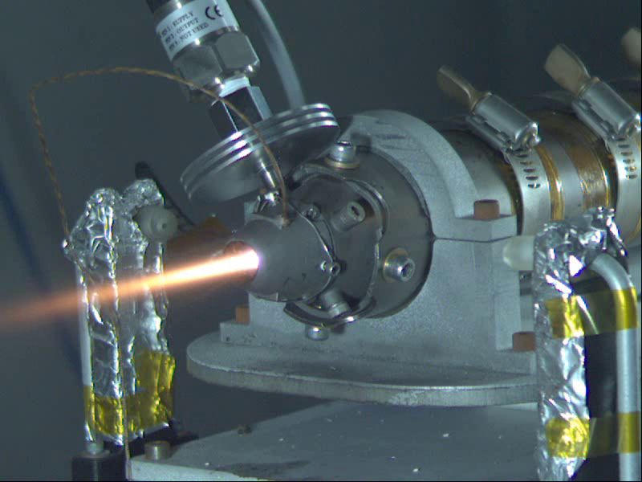
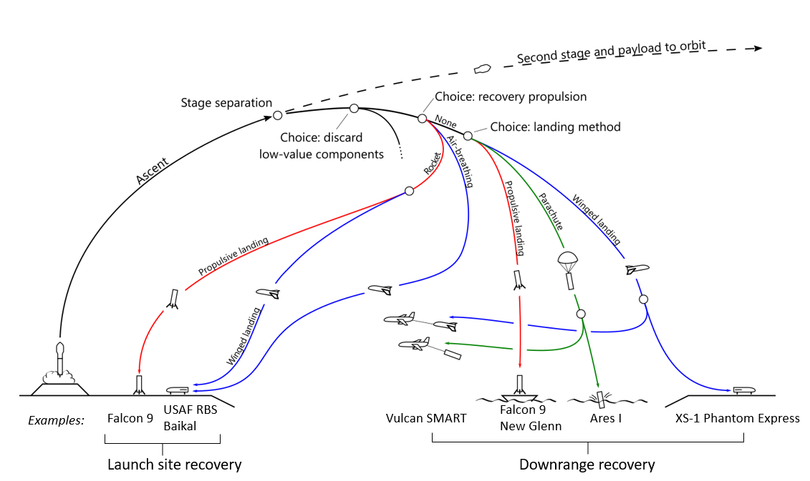
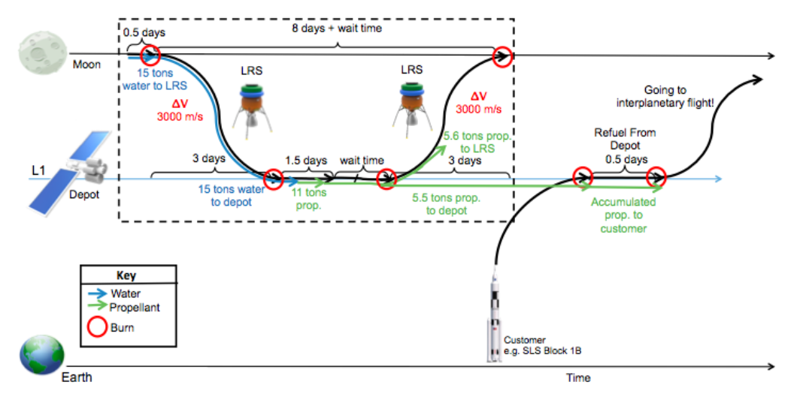
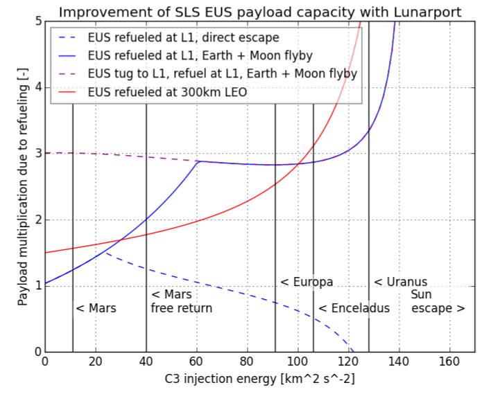
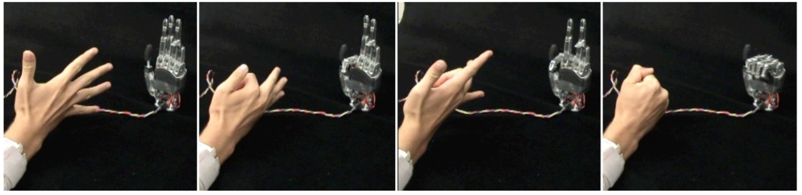

# Publications

## Rocket-Propelled Aircraft
### Development of low-thrust solid rocket motors for small, fast aircraft propulsion

    

    

<strong>Matthew Vernacchia</strong>, Ph.D. Thesis, Massachusetts Institute of Technology, 2020. 
 <a href="https://hdl.handle.net/1721.1/127069">pdf available here</a>
    

### Development, modeling and testing of a slow-burning solid rocket propulsion system

    

    

<strong>Matthew Vernacchia</strong>, MS Thesis, Massachusetts Institute of Technology, 2017.
 <a href="http://hdl.handle.net/1721.1/112515">pdf available here</a>
    

## Space Exploration

### Strategies for reuse of launch vehicle first stages

    

    

<strong>Matthew Vernacchia</strong>, Kelly Mathesius, International Astronautical Congress, 2018.
 <a href="https://github.com/mvernacc/lvreuse/blob/master/paper/IAC-18-D-2-4-3_strategies_for_reuse_of_launch_vehicle_first_stages.pdf">pdf available here</a>
    

### Enabling deep space exploration with an in-space propellant depot supplied from lunar ice

    

    

Sophia Casanova, Jack Henry de Frahan, Vinicius Guimaraes Goecks, ... <strong>Matthew Vernacchia</strong>, ...,  AIAA SPACE Forum, 2017.
 <a href="https://doi.org/10.2514/6.2017-5376">DOI: 10.2514/6.2017-5376</a>, <a href="../assets/docs/publications/6.2017-5376.pdf">pdf available here</a>
    

### The Lunarport concept, a launch and supply station for deep space missions

    

    

A comparative study of the two concepts elaborated at the 2017 Caltech Space Challenge. 
Jerome Gilleron, Danielle DeLatte, Donal O’Sullivan, Pádraig Lysandrou, Joseph Sparta, Gary Li, ... <strong>Matthew Vernacchia</strong>, ..., <i>IAA Symposium on the Future of Space Exploration Towards the Moon Village & Beyond</i>, 2017.
    

## Robotics

### Systems and methods for obtaining user command from gaze direction
<strong>Matthew Vernacchia</strong>, US Patent 8 723 798, 2014. <a href="https://patents.google.com/patent/US8723798">link</a>

### Gesture-based robot control with variable autonomy from the JPL BioSleeve

    

    

Michael T Wolf, Christopher Assad, <strong>Matthew Vernacchia</strong>, Joshua Fromm, Henna L Jethani, <i>IEEE International Conference on Robotics and Automation</i>, 2013.
 <a href="https://doi.org/10.1109/ICRA.2013.6630718">DOI: 10.1109/ICRA.2013.6630718</a>, <a href=".../assets/docs/publications/biosleeve_icra.pdf">pdf available here</a>
    

### Decoding static and dynamic arm and hand gestures from the JPL BioSleeve

    

    

Michael T Wolf, Christopher Assad, Adrian Stoica, Kisung You, Henna L Jethani, <strong>Matthew Vernacchia</strong>, Joshua Fromm, Yumi Iwashia, 2013.
 <a href="https://doi.org/10.1109/AERO.2013.6497171">DOI: 10.1109/AERO.2013.6497171</a>
    

