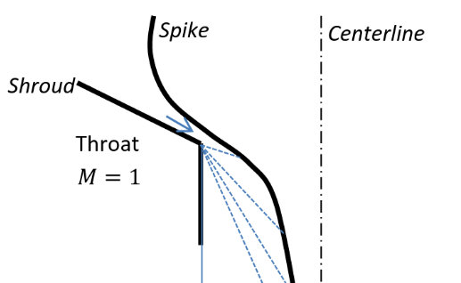

# Software Projects

## Material properties library
<div class="proj_image_row">
    <div class="proj_image_row_image_container"></div>
    <div class="proj_image_row_image_container"></div>
</div>
I'm writing a material properties library in python - so far I have a prototype of the core logic. The ultimate goal is to provide for the interchange of information on material properties between CAD software, FEA software, and custom analysis scripts. I spend a lot of time manually transcribing material properties from MatWeb or MMPDS into SolidWorks and my own python scripts. This process is tedious and error prone - I'd like to make it better, and I imagine other engineers would appreciate this too. It would be valuable for a project to have a single (verified) database of material properties, which all of the project's computational tools (CAD, FEA, analysis scripts) reference.

[example for aeronautical engineering -->](https://github.com/mvernacc/material-properties-interchange/blob/master/tutorials/xplane_airframes.ipynb)

[example for nuclear engineering -->](https://github.com/mvernacc/material-properties-interchange/blob/feature/multi-var-w-state/tutorials/radiation_demo.ipynb)


## Rocket propulsion library

```python
>> from proptools import nozzle
>> p_c = 10e6; p_e = 100e3; gamma = 1.2; m_molar = 20e-3; T_c = 3000.
>> C_f = nozzle.thrust_coef(p_c, p_e, gamma)
>> c_star = nozzle.c_star(gamma, m_molar, T_c)
>> I_sp = C_f * c_star / nozzle.g
>> print "The engine's ideal sea level specific impulse is {:.1f} seconds.".format(I_sp)
The engine's ideal sea level specific impulse is 288.7 seconds.
```

`proptools` is a python package for preliminary design of rocket propulsion systems. It provides implementations of equations for nozzle flow, turbo-machinery and rocket structures. The project aims to cover most of the commonly used equations in *Rocket Propulsion Elements* and *Modern Engineering for Design of Liquid-Propellant Rocket Engines* (Huzel & Huang). It's currently targeted at internal use in my lab, but I am working towards a `v1.0` that could be used by a broader audience.

[check it out on readthedocs -->](https://proptools.readthedocs.io/en/latest/)

## Solid propellant combustion simulation
<div class="proj_image_row">
    <div class="proj_image_row_image_container"></div>
</div>
A simulation of the ignition transient of an ammonium perchlorate composite propellant, implemented in python using [`cantera`](https://cantera.org/) and `numpy`. *In collaboration with Sam Judd.*

[read more -->](../assets/docs/2.28/228_final_report.pdf)

## 2D shock-capturing computation fluid dynamics
<div class="proj_image_row">
    <div class="proj_image_row_image_container"></div>
</div>
For a numerical methods class, I programmed a 2D Euler equation (inviscid Navier-Stokes) solver using a finite-difference MacCormack method. I used artificial dissipation to reduce the non-physical oscillations which occur around shocks in finite difference schemes. My software was implemented in Julia.

[read more -->](../assets/docs/18086/report.pdf)

## Unscented Kalman Filter for 3D attitude estimation

<div class="proj_image_row">
    <div class="proj_image_row_image_container"></div>
    <div class="proj_image_row_image_container"></div>
</div>

I developed a 3D attitude estimator based on the Unscented Kalman Filter (UKF) using a MEMS IMU and a magnetometer. The estimator uses a quaternion representation of attitude, and I explored interesting mathematical issues with applying the UKF algorithm to a quaternion state. I also characterized the sensors' noise, bias, and bias walk.

[read the report -->](../assets/docs/16.322/report.pdf)

[check it out on github -->](https://github.com/mvernacc/16322-3d-pose)

## Aerospike nozzle design GUI
<div class="proj_image_row">
    <div class="proj_image_row_image_container"></div>
</div>
I implemented a method-of-characteristics aerospike nozzle geometry algorithm in python. I created a GUI which enables users to enter engine parameters and view results. After executing the nozzle design algorithm, the program plots temperature, pressure, and Mach number along the nozzle length, and can export the nozzle geometry in a CAD-compatible format.

[check it out on github -->](https://github.com/mvernacc/aerospike-nozzle-design-gui)

## Crew Dragon flight simulator
<div class="proj_image_row">
    <div class="proj_image_row_image_container"></div>
</div>
During 3 internships with SpaceX, I helped to develop a flight simulator for Crew Dragon. I trained several NASA astronauts to fly the simulator, and helped collect their feedback on the display's UI/UX features and on the vehicle's handling qualities. I then worked with human factors experts, designers, and controls engineers to fix issues discovered in these tests. I mostly worked in C++. *I am grateful for the opportunity to have played a small role with the amazing team at SpaceX.*

## LiDAR testing with robotic arm
During an internship with SpaceX, I developed software to replicate vehicle flight trajectories using a MILO robotic arm. This enabled the GNC group to perform flight-like tests of their new LiDAR sensor. *Thanks to Dr. Andrew Howard for an amazing summer!*
